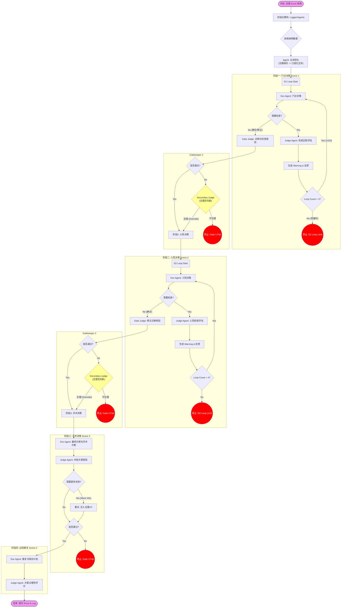

# 临床自动测评系统工作流详解 v2.2 (2025-12 Updates)

> 本文档详细描述测评系统的业务逻辑、数据流转与核心机制。
> **架构更新**: 本版本基于 Python 纯代码架构 (v2.0)，移除了 n8n 依赖，增强了循环控制与容错机制。

---

## 1. 全局工作流图 (Mermaid)

下图展示了从病例加载到最终评分的全过程，包含 4 个核心阶段、3 个 Gatekeeper、以及循环警告机制。

---

## 2. 详细阶段逻辑与数据交互

本节详细描述每个 Agent 在各阶段的 输入 (Prompt Context) 与 输出 (Structured Output)，以及 Gate 的判定规则。

### 2.1 预处理阶段: 主诉转化
*   **目的**: 模拟真实患者表达，隐藏部分专业医学信息。
*   **输入**: 
    - Excel 原始字段: `主诉`, `现病史`, `基本信息`, `月经婚育史`, `年龄`, `性别`
    - (字段名通过模糊匹配获取，自动去除"主诉："等前缀)
*   **动作**: 
    1. **生成**: `PatientDescriptionAgent` (Gemini) 将上述信息重写为第一人称口语 ("我感觉...")。
    2. **核验**: `DoctorAgent` (GPT-4o) 充当核查员，比对生成的口述与原始结构化数据，确保**身高/体重/BMI**等关键客观指标及重要病史无遗漏。如有遗漏则自动补全。
*   **输出**: `patient_description` (字符串) -> 存入 Context。

### 2.0 核心机制: 双重判别 (Secondary Judge)
本系统引入 "Reasonableness Check" 机制，以解决 AI 答案与 GT 不字面匹配但医学合理的问题。
*   **触发条件**: Gate 1 或 Gate 2 判定为 `Mismatch` 时。
*   **输入**: 患者全量客观事实 (History + GT Checks) + AI 诊断。
*   **判定**: AI 的推断是否基于患者事实且医学合理？
*   **结果**:
    *   `Reasonable`: **Override** (标记通过，继续下一步)。
    *   `Unreasonable`: 确认终止。

### 2.2 第一阶段: 门诊决策 (Decision 1)
*   **核心逻辑**: 医生根据主诉进行初步判断，可多次开具检查单。
*   **Context 输入**:
    - 患者口述 (`patient_description`)
    - 基本特征 (年龄, 性别)
    - *Loop > 1 时*: 历史检查结果 + Judge 警告信息 "WARNING: 你遗漏了..."。
*   **Doc Agent 输出**:
    | 字段 | 类型 | 说明 |
    | :--- | :--- | :--- |
    | `需要补充门诊检查` | Bool | True 则进入检查循环; False 则进入 Gate |
    | `门诊信息汇总` | Markdown | 医生思维链记录 |
    | `诊断前所需检查` | List | 请求的检查列表 (如 ["血常规", "B超"]) |
*   **Judge Agent (检查循环)**:
    - **逻辑**: 对比 AI 请求 vs GT (Ground Truth) 门诊检查列表。
    - **Warning 机制**:
        - **Level 1 (Loop 1)**: 提示遗漏的检查项。
        - **Level 2 (Loop 2)**: 再次提示，语气加重。
        - **Level 3 (Loop 3)**: 最终警告 "这是最后一次机会"。
        - **Loop 4 Action**: 如果 AI 依然请求检查 -> **直接判负终止**。

*   **Gatekeeper 1 (入院核查)**:
    - **输入**: AI 初步诊断, AI 建议检查, GT 入院诊断, GT 入院检查。
    - **判定**: 
    - **判定**: 
        1. 诊断大方向是否正确？(模糊匹配)
        2. 关键入院检查是否已开具？
    - **动作**: 评分并决定是否 `Proceed`。
    - **双重保障 (Secondary Judge)**: 若初审失败，启动 Secondary Judge 进行合理性复核。如复核通过，则 Override 失败结果，允许进入下一阶段。

### 2.3 第二阶段: 入院决策 (Decision 2)
*   **核心逻辑**: 结合门诊检查与入院后详细检查，给出确诊和治疗方案。
*   **Context 输入**:
    - 门诊阶段历史
    - `outpatient_checks_feedback`: 门诊阶段所有已执行检查的结果 (from GT)。
    - `admission_checks`: 入院后检查结果 (动态获取)。
*   **Doc Agent 输出**:
    | 字段 | 类型 | 说明 |
    | :--- | :--- | :--- |
    | `能够确诊` | Bool | False 则请求更多入院检查 (进入 Loop) |
    | `修正诊断` | String | 确诊后的诊断名称 |
    | `初步治疗方案` | String | 药物、手术或其他预案 |
*   **Judge Agent (检查循环)**:
    - 逻辑同门诊阶段，但对比的是 `GT_入院检查`。
    
*   **Gatekeeper 2 (诊断核查)**:
    - **判定**: AI `修正诊断` 必须匹配 `GT_入院诊断` 或 `GT_最终诊断` 之一。
    - **严格度**: 中等 (允许同义词，如 "子宫肌瘤" == "多发性子宫肌瘤")。
    - **双重保障 (Secondary Judge)**: 同 Gate 1，支持合理性 Override。

### 2.4 第三阶段: 手术决策 (Decision 3)
*   **核心逻辑**: 确定手术方式。
*   **Context 输入**:
    - 全量病历 (门诊+入院)
    - GT 术中发现 & 病理结果 (作为上帝视角信息提供给 AI，模拟术中决策或术后回顾)。
*   **Doc Agent 输出**:
    - `最终诊断` (含病理分期)
    - `术后治疗方案`
    - `诊疗经过回顾` (Markdown Table, 全局回顾)
    - `术后信息汇总` (Legacy, 仅供参考)
*   **Gatekeeper 3 (手术核查)**:
    - **判定**: AI `最终诊断` vs `GT_最终诊断`。
    - **特殊逻辑**: 如果 AI 诊断不全 (如缺少分期)，Gate 会记录并扣分，通常允许继续进入康复阶段，除非错误太离谱。

### 2.5 第四阶段: 出院康复 (Decision 4)
*   **Doc Agent 输出**: `出院康复计划`, `长期随访计划`, `诊疗经过回顾`.
*   **Judge Agent**: 
    - 评估随访频率是否过高 (过度医疗) 或过低 (忽视风险)。
    - 综合全案表现给出最终评分。

---

## 3. 数据表结构 (输出 Excel)

Excel 输出包含 6 个 Sheet，通过 `CaseID` 严格行对齐。

| Sheet 名称 | 关键内容 | 行数 |
| :--- | :--- | :--- |
| **1. 门诊检查循环** | Loop 1-3 的详细交互 (AI 请求, Judge 警告, Warning Level) | = 病例数 |
| **2. 门诊决策** | D1 最终输出, Gate1 评分, 终止原因 | = 病例数 |
| **3. 入院检查循环** | (同 Sheet 1, 针对入院阶段) | = 病例数 |
| **4. 入院决策** | D2 修正诊断, Gate2 评分 | = 病例数 |
| **5. 手术决策** | D3 手术方案, Gate3 评分 (含病理对比) | = 病例数 |
| **6. 出院康复** | D4 康复计划, 随访建议, 全案最终得分 | = 病例数 |

> **注意**: 如果某病例在 Gate 1 终止，Sheet 3-6 中该病例对应的行依然存在，但内容为空。这是为了方便后续统计分析。

---

## 4. 异常处理与鲁棒性设计

| 异常类型 | 触发条件 | 系统行为 |
| :--- | :--- | :--- |
| **Loop 死循环** | Loop 次数达到 4 且 AI 仍不确诊 | **立即终止** 该病例，标记 Status="Terminated_Loop_Limit" |
| **Gate 拦截** | 诊断/检查匹配度低于阈值 (Judge 判定) | **立即终止** 该病例，标记 Status="Terminated_Gate_Fail" |
| **API 错误** | LLM 接口超时或 500 错误 | SDK 自动重试 (指数退避), 失败多次后切换 Fallback 渠道 |
| **解析错误** | AI 返回非 JSON 格式 | 记录 Error Log，跳过当前步骤 (通常会导致后续 Gate 失败) |
| **断电/崩溃** | 进程意外退出 | 重启后读取 `checkpoint.json`，自动跳过已完成的病例 |

---

## 5. 开发参考

- **代码入口**: `main.py`
- **核心逻辑**: `auto_eval_system/modules/workflow.py`
- **提示词库**: `auto_eval_system/config/prompts_v2.py`
- **日志文件**: `output/raw_traces/` (JSONL 格式，包含 Logprobs)

---

## 6. 版本更新日志 (v2.2 - 2025.12)

### 6.1 核心逻辑调整
1.  **Gate Judge 严格化**: D1 Gate Judge 增加 "Valid Check Extraction" 逻辑，仅提取与 GT 匹配的有效检查内容，防止无关数据的 Dump。
2.  **Context 增强**: D4 阶段现在会完整继承 D3 的手术结果与病理信息。
3.  **Prompt 结构优化**: D2 移除了冗余的 "术后信息汇总"；D3/D4 统一增加了 "诊疗经过回顾" (Medical History Review) 的 Markdown 表格输出。

### 6.2 输出与监控
1.  **Excel 字段扩展**: 新增 `AI_Medical_Review`, `AI_Thinking` 等字段的导出支持。
2.  **Live Monitor 升级**:
    - 支持 **多模型并行** (Session-based Filtering)，解决不同模型同名案例冲突问题。
    - 新增 **Sidebar Quick Jump**，支持按阶段 (Outpatient, Admission, Surgery) 快速导航。
    - 新增 **Minimalist Theme** (极简主题): 一种侧重阅读体验的清爽 UI 风格，支持一键切换。
    - 修复了 `Decision_1_Doc` 归类错误的 Bug (归入 Outpatient Stage)。

### 6.4 运维工具 (New)
新增 `tools/clean_retest_cases.py` 用于自动化处理重测流程：
- **自动识别**: 基于 `checkpoint.json` 和 Excel 结果，自动找出 "Blocked" (中断) 或 "Error" (报错) 的病例。
- **安全备份**: 将旧的 `.jsonl` 和 `.html` 文件移动到 `retest_backup/` 目录，防止数据永久丢失。
- **状态重置**: 从 checkpoints 和 Excel 报告中清除这些病例的记录，确保下次运行 `main.py` 时重新评测这些病例。

### 6.3 线程并发说明
- 系统支持 **Case-Level Parallelism** (案例级并发)。
- 若设置 `threads=5`，系统将同时处理 5 个**案例** (Case)。
- 如果只运行 1 个模型，则该模型的 5 个不同案例会被同时测评。
- 如果运行 5 个模型且 Case 充足，调度器根据队列顺序可能混合执行。
