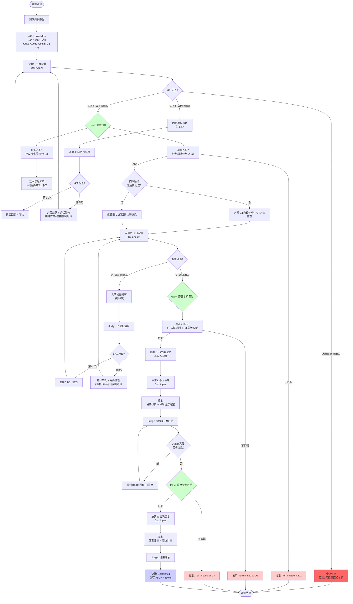

# 临床自动测评系统 Workflow 详解 (v2.0)

> 本文档详细说明评测系统的完整工作流程、各个组件的职责、数据流转以及关键配置。
> 
> **最后更新**: 2025-12-09  
> **版本说明**: 基于 n8n 11.14 版本工作流和用户需求反馈完善

---

## 目录
1. [整体流程图](#整体流程图)
2. [阶段详解](#阶段详解)
   - [决策1: 门诊决策与循环](#决策1-门诊决策与循环)
   - [决策2: 入院决策与循环](#决策2-入院决策与循环)
   - [决策3: 手术决策](#决策3-手术决策)
   - [决策4: 出院康复](#决策4-出院康复)
3. [Doc Agent 详解](#doc-agent-详解)
4. [Judge Agent 详解](#judge-agent-详解)
5. [数据持久化详解](#数据持久化详解)
6. [模型配置说明](#模型配置说明)

---

## 整体流程图



---

## 阶段详解

### 决策1: 门诊决策与循环

#### 目标
模拟医生在门诊阶段收集必要检查信息，并形成初步诊断。

#### 输入数据
- **病历基础信息** (`决策信息`): 患者年龄、G/P、体格检查等
- **主诉描述** (`患者描述`): 经过 LLM 口语化转换的患者自述
- **GT 门诊检查** (`stage1_gt.actual_checks`): 真实完成的门诊检查报告

#### Doc Agent 行为

**调用方法**: [`doctor_agent.make_outpatient_decision`](file:///d:/研究生/项目/课题7-临床评测/自动测评系统/auto_eval_system/modules/doctor_agent.py#L13-L22)

**使用的 Prompt** (来自 n8n):
- System Prompt: 见 [n8n 临床评测 11.14.json L62-L78](file:///d:/研究生/项目/课题7-临床评测/自动测评系统/n8n%20legacy%20proj%20file/临床评测%2011.14.json#L62-L78)

**三种可能的输出场景**:

| 场景 | 关键字段 | 说明 | 后续流程 |
|:---|:---|:---|:---|
| **场景1: 信息不足** | `需要补充门诊检查: true` | 请求门诊检查，最多2项 | 进入门诊检查循环 |
| | `诊断前所需检查` | 例如: ["妇科超声", "血常规"] | |
| **场景2: 需入院检查** | `需要补充门诊检查: false` | 已有初步诊断 | 进入Gate判断 |
| | `需要进一步检查: true` | | |
| | `初步诊断列表` | 最多5个，按可能性排序 | |
| | `建议检查项目` | 入院后检查，最多5项 | |
| **场景3: 直接确诊** | `需要进一步检查: false` | ⚠️ 危险：无任何检查直接诊断治疗 | **强制中止评测** |
| | `修正诊断` | 明确诊断 | 状态: Terminated at D1 (Scene3) |

#### 门诊检查循环 (Loop)

**触发条件**: 场景1（`需要补充门诊检查: true`）

**Judge Agent 行为**:

**调用方法**: [`judge_agent.check_requested_tests`](file:///d:/研究生/项目/课题7-临床评测/自动测评系统/auto_eval_system/modules/judge_agent.py#L130-L151)

**Judge Prompt**: 见 [n8n L578-L601](file:///d:/研究生/项目/课题7-临床评测/自动测评系统/n8n%20legacy%20proj%20file/临床评测%2011.14.json#L578-L601)

**输出格式**:
```json
{
  "match": ["是", "相似", "否", "否", "相似"],  // 长度与请求检查数量一致
  "reason": ["1. 检查A与实际检查X相似...", "2. 检查B完全匹配...", ...],
  "建议下一步输入的检查内容": "血常规: Hb 110g/L\\n妇科超声: 子宫...",
  "AI建议但实际未执行的检查": "盆腔MRI在门诊阶段并未进行\\n宫颈TCT在门诊阶段并未进行"
}
```

> [!WARNING]
> **警告机制修正** (关键变化):
> - **第1次缺失**: 返回匹配信息 + "XXX在门诊阶段并未进行"
> - **第2次缺失**: 同上
> - **第3次缺失**: 返回匹配信息 + **最后警告** ("你所列出的检查均未进行...请不要再索要...")
> - **第4次请求检查**: 强制退出循环，进入 Gate 判断

#### Gate: 双重判断

**判断维度1: 初步诊断列表匹配**

**调用方法**: [`judge_agent.evaluate_diagnosis_match`](file:///d:/研究生/项目/课题7-临床评测/自动测评系统/auto_eval_system/modules/judge_agent.py#L110-L128) (strict_mode=False)

**匹配规则**:
- ✅ GT的1-多个诊断中，**至少一个**与AI的主要诊断（初步诊断列表第一项）匹配即可
- ✅ 方向一致（如 "异常子宫出血" 包含 "子宫内膜息肉" 作为病因）
- ❌ 完全不相关则失败 → **终止评测**

**判断维度2: 建议检查项目匹配**

**作用**: 决定传递给决策2的上下文内容
- ✅ 如果匹配，返回完整的检查结果文本
- ❌ 如果不匹配，返回警告文本（影响Doc Agent下一轮决策质量）

---

### 决策2: 入院决策与循环

#### 目标
基于门诊初步诊断，收集入院检查信息，形成修正/确诊诊断并制定初步治疗方案。

#### 输入数据构建 (重要逻辑)

**情况1: 门诊循环未执行过**
- 合并 `GT门诊检查` + `GT入院检查`
- 原因: 防止门诊检查/检验不被利用

**情况2: 门诊循环已执行**
- 仅使用决策1循环中 Agent 返回的检查信息
- 不再包含 GT 门诊检查

**上下文组成**:
```
**【决策1: 门诊初诊】**
- 患者信息: {decision_info}
- 患者描述: {patient_description}
- 门诊循环获得的所有检查反馈 (含匹配/未匹配/警告)

**【决策2: 入院诊疗】**
- 初步诊断: {preliminary_diagnosis}
- 入院检查结果: {合并或单独的检查文本}
```

#### Doc Agent 行为

**调用方法**: [`doctor_agent.make_admission_decision`](file:///d:/研究生/项目/课题7-临床评测/自动测评系统/auto_eval_system/modules/doctor_agent.py#L24-L34)

**使用的 Prompt** (来自 n8n): 见 [n8n L2224-L2249](file:///d:/研究生/项目/课题7-临床评测/自动测评系统/n8n%20legacy%20proj%20file/临床评测%2011.14.json#L2224-L2249)

**两种可能输出**:

| 场景 | 关键字段 | 说明 |
|:---|:---|:---|
| **能够确诊** | `能够确诊: true` | 可以给出确定诊断 |
| | `诊疗经过回顾` | MD格式的结构化表格 |
| | `修正诊断` | 一个明确的具体诊断 |
| | `初步治疗方案` | 详细方案（手术/药物/放化疗等）|
| | `诊疗思维` | 列表形式 |
| | `置信度评估` | 诊断置信度 + 治疗方案置信度 |
| **无法确诊** | `能够确诊: false` | 检查结果不足 |
| | `需要补充检查` | 列出还需要的检查 |
| | `理由` | 说明原因 |

#### 入院检查循环 (Loop)

逻辑与门诊检查循环相同，但警告文本使用 `"XXX在入院检查阶段并未进行"`。

#### Gate: 修正诊断匹配

**调用**: `evaluate_diagnosis_match` (strict_mode=False，但要求更严格)

**输入**:
- AI输出: `修正诊断`
- GT对比: `GT入院诊断` + `GT最终诊断` (两者都提供给Judge，让其权衡)

**匹配规则**:
- 考虑GT可能模糊，而AI输出精确的情况
- 如果AI的修正诊断与GT入院诊断**或**GT最终诊断相似，均可通过

#### 额外: 手术方案匹配 (记录性质)

**时机**: 修正诊断匹配成功后

**调用**: Judge Agent 对比 `初步治疗方案` 中的手术方案与 `GT手术方案`

**作用**:
- 仅记录匹配情况到日志
- **不阻断流程**
- 如果不匹配，给Doc Agent反馈并提供实际治疗方案（作为决策3的上下文）

---

### 决策3: 手术决策

#### 目标
基于术中所见和病理结果，给出最终诊断和术后治疗方案。

#### 输入数据

**上下文**:
```
**【决策1: 门诊初诊】**
(完整的决策1 Prompt + 输出)

**【决策2: 入院诊疗】**
(完整的决策2 Prompt + 输出)

**【决策3输入信息】**
- 实际实施的手术所见及病理报告: {GT}
- 实际实施的手术方案: {GT或决策2反馈}
```

#### Doc Agent 行为

**调用方法**: [`doctor_agent.make_surgery_decision`](file:///d:/研究生/项目/课题7-临床评测/自动测评系统/auto_eval_system/modules/doctor_agent.py#L36-L46)

**使用的 Prompt**: 见 [n8n L2224-L2233](file:///d:/研究生/项目/课题7-临床评测/自动测评系统/n8n%20legacy%20proj%20file/临床评测%2011.14.json#L2224-L2233)

**完整输出格式** (来自n8n):
``json
{
  "最终诊断": {
    "诊断名称": "例如：子宫内膜样腺癌，FIGO IA期，G1",
    "诊断思维": "1. 术后病理是诊断的金标准...\\n2. 术中探查及病理回报显示...\\n3. 细胞分化良好，病理分级为G1。"
  },
  "术后治疗方案": {
    "方案详情": "1. **化疗**: 紫杉醇+卡铂方案...\\n2. **放疗**: 暂不推荐。\\n3. **其他**: 建议进行基因检测...",
    "方案思维": "1. 根据FIGO分期和NCCN指南...\\n2. 但考虑到患者可能存在的其他高危因素...\\n3. 此处提出的方案是可选方案之一..."
  },
  "置信度评估": {
    "最终诊断置信度": 1.0,
    "术后治疗方案置信度": 0.8
  }
}
```

> [!NOTE]
> **关键字段说明**:
> - `诊断思维` 和 `方案思维` 分别阐述诊断和治疗的逻辑
> - 每个决策信息都对应独立的置信度

#### Judge Agent 行为

**Judge Prompt**: 见 [n8n L2252-L2276](file:///d:/研究生/项目/课题7-临床评测/自动测评系统/n8n%20legacy%20proj%20file/临床评测%2011.14.json#L2252-L2276)

**输出格式**:
```json
{
  "诊断匹配评估": {
    "结论": "完全一致 | 高度相似 | 部分匹配 | 完全不同",
    "理由": "1. AI的最终诊断与实际诊断在疾病名称、分期、分级上的对比分析。\\n2. AI是否准确利用了病理报告信息。"
  },
  "治疗方案匹配评估": {
    "结论": "完全一致 | 方案合理但有差异 | 遗漏关键治疗 | 方案不合理",
    "理由": "1. AI建议的治疗方案与临床实际采用的方案对比。\\n2. AI的方案是否符合临床指南。\\n3. AI是否考虑到了'无需治疗'的特殊情况。"
  },
  "综合评价": "总结性评价..."
}
```

#### Gate: 最终诊断匹配（严格模式）

**调用**: `evaluate_diagnosis_match` (strict_mode=True)

**匹配规则**:
- ✅ 尽量要求完全一致（包括分期、分级、分型）
- ✅ 允许细微容错（代表不同医生对同一情况的诊断波动）
- ✅ 特殊情况: 如果AI的最终诊断比较宽泛，Judge Agent 可以请求更多信息

**More Info 机制**:
- 如果 Judge 输出中包含 `{"need_more_info": true, ...}`
- 系统自动提供 D1-D3 阶段的**所有GT信息**
- Judge 重新评估

---

### 决策4: 出院康复

#### 目标
基于最终确定的术后治疗方案和患者意愿，制定康复和随访计划。

#### 输入数据

**上下文**:
```
**【决策1-3完整历史】**
(所有Prompt + 输出，分割为三个阶段)

**【决策4输入信息】**
- 最终实际执行的术后治疗计划(GT): {actual_post_op_plan}
- 患者的意愿及特殊情况: {patient_wishes}
- AI在决策3的建议: {decision3_output}
```

#### Doc Agent 行为

**调用方法**: [`doctor_agent.make_discharge_decision`](file:///d:/研究生/项目/课题7-临床评测/自动测评系统/auto_eval_system/modules/doctor_agent.py#L48-L58)

**使用的 Prompt**: 见 [n8n L2338-L2362](file:///d:/研究生/项目/课题7-临床评测/自动测评系统/n8n%20legacy%20proj%20file/临床评测%2011.14.json#L2338-L2362)

**输出格式** (完整版):
```json
{
  "出院康复计划": {
    "方案详情": "1. **创口护理**: ...\\n2. **饮食指导**: ...\\n3. **活动建议**: ...\\n4. **心理支持**: ...",
    "制定依据": "该康复计划是基于患者[具体术后方案]的标准恢复路径，并结合患者[具体意愿或情况]..."
  },
  "长期随访计划": {
    "是否需要常规随访": true,  // 重要: 良性病变或观察性治疗应为 false
    "方案详情": "1. **术后1个月**: 妇科检查...\\n2. **术后3个月**: 妇科检查 + 盆腔超声...\\n3. **术后第1-2年**: 每3-6个月复查一次...",
    "制定依据": "该随访计划遵循[对应疾病]的NCCN/CSCO标准指南..."
  },
  "置信度评估": {
   "康复计划置信度": 0.9,
    "随访计划置信度": 0.8
  }
}
```

> [!IMPORTANT]
> **条件性随访逻辑**:
> - 如果最终诊断为良性，或治疗计划为"观察"
> - `是否需要常规随访` 应设为 `false`
> - `制定依据` 需明确说明："患者为良性病变，术后无需特殊随访，建议年度常规妇科体检即可。"

#### Judge Agent 行为

使用通用评估: [`evaluate_generic_stage`](file:///d:/研究生/项目/课题7-临床评测/自动测评系统/auto_eval_system/modules/judge_agent.py#L90-L108)

---

## Doc Agent 详解

### 核心类
[`DoctorAgent`](file:///d:/研究生/项目/课题7-临床评测/自动测评系统/auto_eval_system/modules/doctor_agent.py)

### 四个决策方法对比

| 方法 | 阶段 | 主要输入 | 主要输出字段 | 诊疗经过回顾 |
|:---|:---|:---|:---|:---|
| `make_outpatient_decision` | 门诊 | 病史、主诉 (无历史) | `初步诊断列表`, `诊断前所需检查` | ❌ 无 |
| `make_admission_decision` | 入院 | 初步诊断、检查结果<br/>**+ 决策1完整历史** | `修正诊断`, `初步治疗方案`<br/>`诊疗经过回顾` | ✅ 有 |
| `make_surgery_decision` | 手术 | 术中所见、病理<br/>**+ 决策1-2完整历史** | `最终诊断`, `术后治疗方案` | ❌ 无<br/>(已在输入中) |
| `make_discharge_decision` | 出院 | 最终诊断、治疗经过<br/>**+ 决策1-3完整历史** | `出院医嘱`, `随访计划` | ❌ 无<br/>(已在输入中) |

### 置信度要求

每个决策信息都需要独立的置信度评估：

**决策1 (场景2)**:
```json
"置信度评估": {
  "诊断置信度": 0.8,      // 对整个初步诊断列表的置信度
  "检查方案置信度": 0.9
}
```

**决策2**:
```json
"置信度评估": {
  "诊断置信度": 0.9,      // 对修正诊断的置信度
  "治疗方案置信度": 0.85
}
```

**决策3**:
```json
"置信度评估": {
  "最终诊断置信度": 1.0,   // 基于病理，通常很高
  "术后治疗方案置信度": 0.8
}
```

**决策4**:
```json
"置信度评估": {
  "康复计划置信度": 0.9,
  "随访计划置信度": 0.85
}
```

### LLM 配置

- **Doc Agent 客户端**: 通过 `utils.llm_client.get_doctor_client()` 获取
- **可选模型** (5选1):
  - gemini-2.5-pro
  - gpt-5-2025-08-07
  - claude-opus-4-1-20250805
  - deepseek-v3-1-think-250821
  - grok-4
- **Temperature**: 0.5 (允许一定创造性)
- **JSON Mode**: 强制 JSON 输出

---

## Judge Agent 详解

### 核心类
[`JudgeAgent`](file:///d:/研究生/项目/课题7-临床评测/自动测评系统/auto_eval_system/modules/judge_agent.py)

### LLM 配置

- **Judge Agent 客户端**: 通过 `utils.llm_client.get_judge_client()` 获取
- **固定模型**: **Gemini 2.5 Pro**
- **Temperature**: 0.0-0.1 (严格评判)
- **JSON Mode**: 强制 JSON 输出

### 关键方法

#### 1. `check_requested_tests`

**作用**: 使用 LLM 对比请求的检查与实际检查。

**输入**:
- `requested_tests`: AI 请求的检查项列表（字符串或列表）
- `available_tests_text`: GT 中实际检查的完整文本

**输出示例** (注意：match数组长度与请求检查数量一致):
```json
{
  "match": ["是", "相似", "否", "否", "相似"],  // 5个检查 -> 5个结果
  "reason": [
    "1. AI请求的'妇科超声'与实际的'经阴道超声'功能相似。\\n2. AI请求的'血常规'完全匹配。\\n3. AI请求的'盆腔MRI'未在门诊阶段进行。\\n4. AI请求的'宫颈TCT'未在门诊阶段进行。\\n5. AI请求的'CA125'与实际的'肿瘤标志物检测'相似。"
  ],
  "建议下一步输入的检查内容": "血常规: Hb 110g/L, WBC 6.5×10^9/L\\n经阴道超声: 子宫形态规整，肌层回声均匀，内膜厚约6mm...\\n肿瘤标志物: CA125 35U/ml",
  "AI建议但实际未执行的检查": "盆腔MRI在门诊阶段并未进行\\n宫颈TCT在门诊阶段并未进行"
}
```

**Prompt 核心** (来自 n8n):
```
你是一位顶级的妇科门诊医疗质量控制（QC）专家。你的任务是基于"实际检查"来评估"LLM建议检查"的合理性。

核心原则：
1. 一个"实际检查"可能对应多个功能相似的"LLM建议检查"。
   逐项匹配: 以"LLM建议检查"中的每一项为基准，在"实际做的门诊检查"中寻找功能上最接近的匹配项。
   形成逐项结论: 为每一次匹配生成 "是 | 相似 | 否" 的结论。

2. 识别未执行项: 找出那些LLM建议了，但实际检查中完全找不到对应项的检查。

3. 汇总行动建议:
   - 将所有匹配上的（"是"或"相似"）、且有实际检查结果的项目，将其实际检查/检验整合成建议下一步输入的检查内容。
   - 将所有未执行的检查项，按照指定格式汇总成AI建议但实际未执行的检查。
```

#### 2. `generate_missing_test_warning`

**输入**:
- `missing_tests`: 缺失的检查项列表
- `stage`: "outpatient" 或 "admission"
- `warning_level`: 1, 2, 或 3

**输出示例**:

```python
# warning_level = 1 或 2
"其中 血常规,妇科超声 在门诊阶段并未进行。"

# warning_level = 3 (Force Exit 前的最后警告)
"你所列出的检查：血常规,妇科超声 均未进行，因此都不能给你，你所获取到的所有检查，检验即为患者所有检查，检验，请不要再索要任何检查信息，根据当前所有信息来进行这一阶段临床决策。"
```

#### 3. `evaluate_diagnosis_match`

**参数**:
- `ai_diagnosis`: AI 输出的诊断
- `actual_diagnosis`: GT 诊断（可能包含多个，用分号分隔）
- `strict_mode`: 
  - `False`: 部分匹配（决策1、2）
  - `True`: 严格匹配（决策3）

**特殊逻辑**:
- 决策2的修正诊断匹配时，同时输入 `GT入院诊断` 和 `GT最终诊断`
- Judge Agent 权衡两者与AI输出的相似程度

---

## 数据持久化详解

### 输出形式

**1. JSON 文件** (全量记录)
- 文件命名: `<CaseID>_<model>_report.json`
- 内容: 包含每轮 LLM 的完整 messages、Judge 的详细输出、时间戳等
- 目的: 完整可追溯性，供深度分析和问题排查

**2. Excel 文件** (可读性分析)
- 文件命名: `evaluation_<model>_<center>.xlsx`
- 结构: **6个 Sheet**，每个对应一个评测阶段

### Excel 表结构 (6个 Sheet)

根据 `ref/` 目录的实际结构和用户需求：

#### Sheet 1: 门诊决策 (含场景3)

| 列名 | 说明 | 数据来源 |
|:---|:---|:---|
| **元数据** | | |
| 病例ID | 病例唯一标识 | Context |
| 行号 | Excel 原始行号 | Context |
| 模型 | Doc Agent 模型名 | Config |
| 环节状态 | 完成/终止/错误 | System |
| | | |
| **Context信息** | | |
| 门诊前信息 | decision_info + patient_description | Context |
| | | |
| **AI输出** | | |
| AI 门诊信息汇总 | Doc Agent 输出 | AI |
| AI 初步诊断列表 | 场景2/3 | AI |
| AI 建议检查项目 | 场景2 | AI |
| AI 诊断思维过程 | | AI |
| AI 置信度评估 | JSON字符串 | AI |
| AI 修正诊断 | 场景3特有 | AI |
| AI 治疗方案 | 场景3特有 | AI |
| AI原始JSON | 完整输出 | AI |
| | | |
| **GT参考** | | |
| 标准答案·门诊检查 | | GT |
| 标准答案·入院诊断 | 用于Gate判断 | GT |

#### Sheet 2: 门诊检查循环

| 列名 | 说明 | 数据来源 |
|:---|:---|:---|
| 病例ID | | |
| 循环次数 | 1-3 | System |
| | | |
| **Context** | | |
| AI请求的检查项 | Doc Agent 输出 | Context |
| 用户提供的门诊检查 | 人工输入或自动匹配 | Context |
| | | |
| **Judge输出** | | |
| Judge匹配结果 | match数组 | Judge |
| Judge理由 | reason | Judge |
| 建议下一步输入的检查内容 | 返回给Doc Agent | Judge |
| AI建议但实际未执行的检查 | 警告内容 | Judge |
| 警告级别 | 1/2/3 | System |

#### Sheet 3: 入院决策

| 列名 | 说明 | 数据来源 |
|:---|:---|:---|
| 病例ID | | |
| | | |
| **Context** | | |
| 决策1传递的上下文 | 完整的门诊历史 | Context |
| 入院检查合并情况 | 是否合并了门诊检查 | Context |
| | | |
| **AI输出** | | |
| AI 能够确诊 | true/false | AI |
| AI 诊疗经过回顾 | MD格式表格 | AI |
| AI 修正诊断 | | AI |
| AI 初步治疗方案 | | AI |
| AI 手术方案 | 从治疗方案中提取 | AI |
| AI 诊疗思维 | | AI |
| AI 置信度评估 | | AI |
| AI原始JSON | | AI |
| | | |
| **GT参考** | | |
| 标准答案·修正诊断 | | GT |
| 标准答案·手术方案 | | GT |
| | | |
| **Judge输出** | | |
| Judge诊断匹配结果 | | Judge |
| Judge手术方案匹配结果 | 仅记录 | Judge |

#### Sheet 4: 入院检查循环

(结构同Sheet 2，但 stage="admission")

#### Sheet 5: 手术决策

| 列名 | 说明 | 数据来源 |
|:---|:---|:---|
| 病例ID | | |
| | | |
| **Context** | | |
| 决策1-2传递的上下文 | 完整历史 | Context |
| 实际手术所见及病理 | | Context/GT |
| | | |
| **AI输出** | | |
| AI 最终诊断·诊断名称 | | AI |
| AI 最终诊断·诊断思维 | | AI |
| AI 术后治疗方案·方案详情 | | AI |
| AI 术后治疗方案·方案思维 | | AI |
| AI 置信度评估 | | AI |
| AI原始JSON | | AI |
| | | |
| **GT参考** | | |
| 标准答案·最终诊断 | | GT |
| 标准答案·术后治疗计划 | | GT |
| | | |
| **Judge输出** | | |
| Judge诊断匹配评估·结论 | | Judge |
| Judge诊断匹配评估·理由 | | Judge |
| Judge治疗方案匹配评估·结论 | | Judge |
| Judge治疗方案匹判评估·理由 | | Judge |
| Judge综合评价 | | Judge |
| Judge是否请求更多信息 | | Judge |

#### Sheet 6: 出院康复

| 列名 | 说明 | 数据来源 |
|:---|:---|:---|
| 病例ID | | |
| | | |
| **Context** | | |
| 决策1-3传递的上下文 | 按三阶段分割 | Context |
| 患者意愿情况 | | Context/GT |
| | | |
| **AI输出** | | |
| AI 出院康复计划·方案详情 | | AI |
| AI 出院康复计划·制定依据 | | AI |
| AI 长期随访计划·是否需要常规随访 | | AI |
| AI 长期随访计划·方案详情 | | AI |
| AI 长期随访计划·制定依据 | | AI |
| AI 置信度评估 | | AI |
| AI原始JSON | | AI |
| | | |
| **GT参考** | | |
| 标准答案·康复计划 | 如有 | GT |
| 标准答案·随访计划 | 如有 | GT |
| | | |
| **Judge输出** | | |
| Judge评分 | | Judge |
| Judge反馈 | | Judge |

### 元信息汇总

在每个 Sheet 中都包含以下元信息列，便于后续数据分析：

- **评测元信息**:
  - 评测模型 (Doc Agent)
  - Judge模型 (固定 Gemini 2.5 Pro)
  - 评测时间戳
  - 评测人员 (若有)
  - 医疗中心 (佛山/武汉/新疆)

- **阶段元信息**:
  - 循环次数 (循环阶段)
  - 警告次数 (循环阶段)
  - Gate通过/失败 (决策阶段)
  - Judge评分 (所有阶段)

---

## 模型配置说明

### Doc Agent 模型池 (5选1)

根据 [n8n L11-L38](file:///d:/研究生/项目/课题7-临床评测/自动测评系统/n8n%20legacy%20proj%20file/临床评测%2011.14.json#L11-L38) 和 [api.txt](file:///d:/研究生/项目/课题7-临床评测/自动测评系统/n8n%20legacy%20proj%20file/api.txt):

| 模型名称 | API 节点 | 用途 |
|:---|:---|:---|
| gemini-2.5-pro | Gala API | 主力模型 |
| gpt-5-2025-08-07 | 稳定GPT节点 | 高质量推理 |
| claude-opus-4-1-20250805 | CLD节点 | 长文本理解 |
| deepseek-v3-1-think-250821 | DS节点 | 思考链推理 |
| grok-4 | 综合节点 | 多模态能力 |

### Judge Agent 模型 (固定)

- **模型**: Gemini 2.5 Pro
- **原因**: 医疗领域知识丰富，评判准确性高
- **API**: Gala API

---

## 常见问题与调试

### Q1: 如何理解"第3次警告后第4次才强制退出"？

**时间线**:
1. **第1次**请求缺失检查 → Judge返回匹配 + 警告1
2. **第2次**请求缺失检查 → Judge返回匹配 + 警告2
3. **第3次**请求缺失检查 → Judge返回匹配 + **最后警告**
4. **第4次**请求缺失检查 → 系统强制退出循环，进入Gate

### Q2: 为什么决策2要合并门诊和入院检查？

**场景**: 如果在决策1阶段，Doc Agent选择了场景2（`需要进一步检查: true`），直接跳过了门诊检查循环。

**问题**: GT 中的门诊检查信息会被浪费。

**解决方案**: 在决策2时，将 `GT门诊检查` 和 `GT入院检查` 合并后一起与AI请求的检查匹配。

### Q3: Excel 日志如何方便核查和数据分析？

**核查场景**:
- Sheet 2/4 记录了每次循环的完整交互，可追踪死循环原因
- AI和GT列并排显示，便于对比
- Judge的匹配结果和理由直接可见

**数据分析场景**:
- 循环次数统计 → 评估模型稳定性
- Judge评分分布 → 评估模型准确性
- 警告次数统计 → 识别模型过度索要检查的问题
- 诊断匹配结果 → 按阶段分析准确率

### Q4: 如何处理GT数据缺失？

**情况1: 修正诊断为"无"**
- 使用门诊诊断的第一条（主要诊断）作为替代
- 在 DataLoader 中实现自动回填逻辑
- 记录警告日志："修正诊断缺失，已使用门诊主要诊断代替"

**情况2: 最终诊断缺失**
- 在 DataLoader 加载时检查必填字段
- 提前警告并跳过该病例（记录到错误日志）
- **不在决策3时才fail**，避免浪费前序步骤的计算资源

---

## 后续优化建议

### 1. GT数据完整性检查

**实现位置**: `DataLoader.__init__` 或 `load_patients` 方法

**检查项**:
- `stage1_gt.actual_checks` 是否存在
- `stage2_gt.actual_diagnosis` 是否存在
- `stage3_gt.final_diagnosis` 是否存在
- 如缺失，输出警告:"[CaseID] 缺少关键GT字段: {missing_fields}，已跳过"

### 2. 中间状态详细记录

**增强 Logger**:
- 增加 `Cycle_History` 字段（JSON格式）
- 记录每次循环的:
  - Doc Agent 请求内容
  - Judge匹配结果
  - 返回的反馈文本
  - Loop计数器状态

**用途**: 分析死循环原因、优化Prompt

### 3. Judge Agent "More Info" 机制

**触发条件**: Judge 输出包含 `{"need_more_info": true}`

**系统响应**:
- 自动拼接 D1-D3 所有GT信息
- 重新调用 Judge
- 记录"More Info Request"到日志

### 4. Prompt 版本控制

**方案**: 将所有 Prompt 导出为独立的配置文件

**格式** (建议):
```yaml
# prompts_v1.yaml
decision1:
  system: |
    # **角色定义**
    你是一位经验丰富的妇科专家...
  user_template: |
    请基于以下门诊信息进行诊断...

decision2:
  system: |
    ...
```

**读取**: 代码和n8n都从同一个YAML读取，确保一致性

---

**文档维护者**: Antigravity AI  
**技术栈**: Python 3.x, pandas, openpyxl, LLM API (Gemini/GPT/Claude/DeepSeek/Grok)  
**版本**: v2.0 (2025-12-09)
