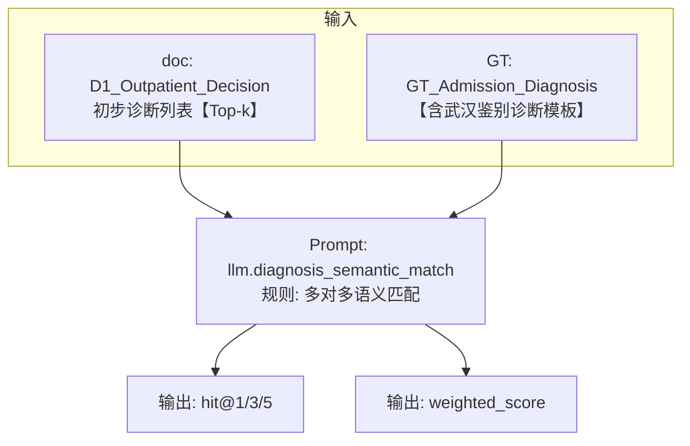
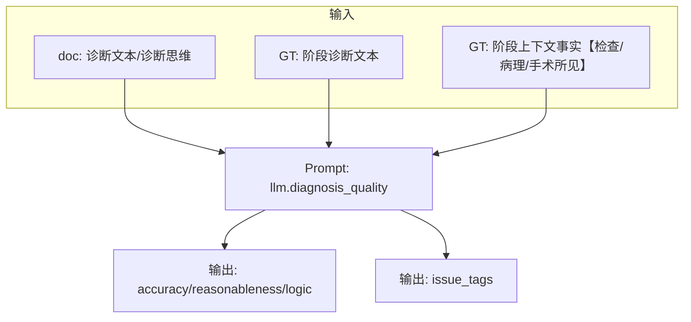
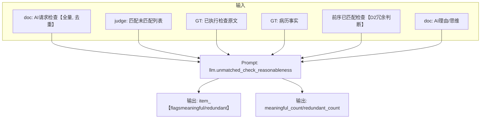
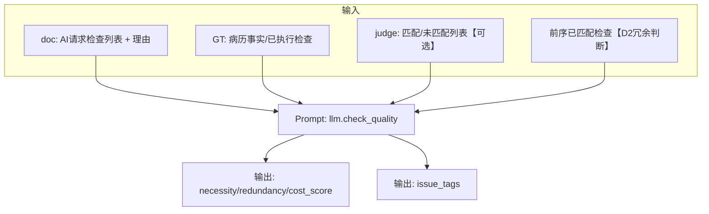
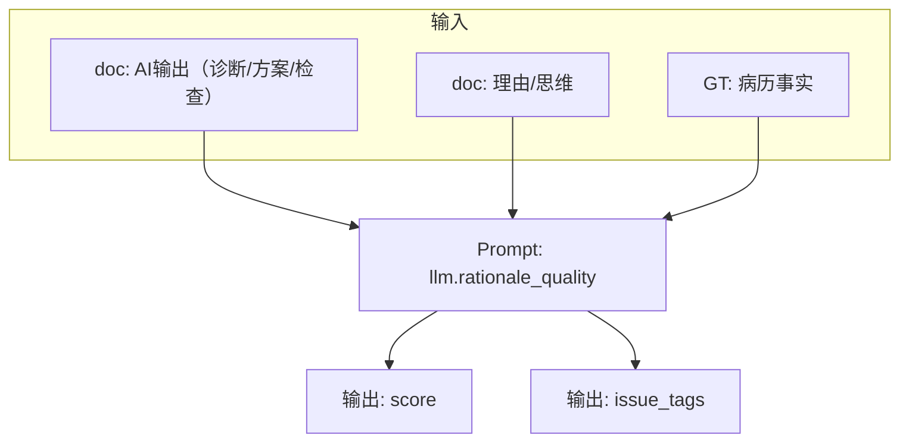
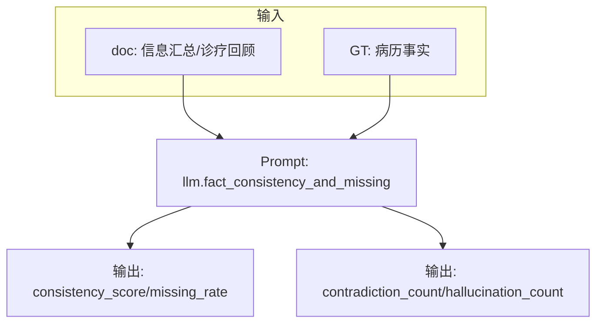
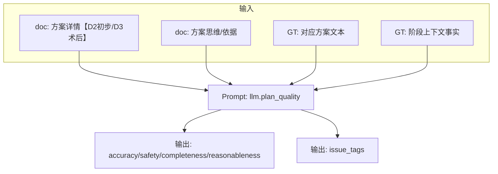
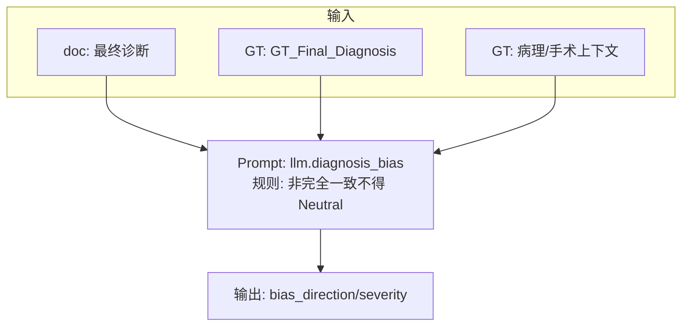
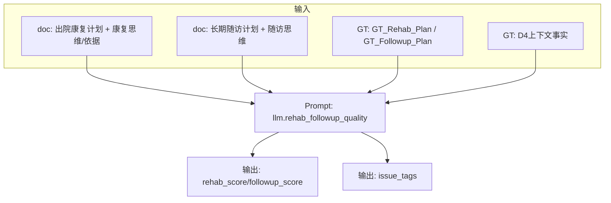

# 指标评测总说明（通俗版，优先审阅）

> 你之前反馈“文档太复杂、看不懂”。这份文件按你的要求重写为**一个大MD**：  
> - 先给“阶段→维度→指标”的总表（结构对齐 `docs/评测指标目前设想.md`，不丢指标）  
> - 再逐指标写清：**用哪个 Excel / sheet / 列**、**怎么算（公式/提示词）**、**需要哪些上下文**、**如何导出可复核的 source data**  
> - 不再使用 “canonical”等术语；统一叫：**检查匹配重建表 / 合理性标注表 / 信息增益标注表** 等

---

## 0) 已拍板口径（执行与报告统一按此）

| 主题 | 口径 |
|---|---|
| D1 决策异常输出（D1 出现“修正诊断/治疗方案”，但缺“初步诊断/建议检查”） | **D1 计失败**；同时按 **D2 指标体系照常评分并纳入 D2 统计**，并标记 `is_anomaly_d1_to_d2=true` |
| 检查匹配率(严格) | 分母=AI“请求检查数”；分子=“已执行且与GT检查语义匹配”的数量（优先复用 judge 的匹配结果/计数，不做字符 exact match） |
| 检查合理性匹配率(扩展，待实现) | 分母=AI“请求检查数”；分子=匹配数 + **未匹配但仍有临床意义且非冗余**的数量（需 LLM 标注；当前先以 strict 指标产出并做可追溯审阅） |
| 继承度（重复开单） | **两个方向都输出**：`重复率(越低越好)` 与 `非重复比例(越高越好)=1-重复率` |
| 无效循环率 | 优先复用现有 judge 每轮字段：`第i轮_判官_原始JSON_匹配数量` / `总请求数量` / `评分_检查匹配度`（并输出逐轮 source data 便于人工复核）；但计数时以“AI真实提项”为基准做**检查匹配重建**（保留 raw judge 值对照） |
| Top-k 诊断覆盖率 | **只评 D1 初步诊断**；k 固定 `{1,3,5}` |
| 鉴别诊断 | **仅武汉存在**，格式统一：`初步诊断:...` + `鉴别诊断:...`；按模板算法拆分为结构化列表再做多对多语义匹配 |

---

## 1) 数据源速查（只读 `data/` 与 `docs/`；不改原始Excel）

| 类型 | 路径模式 | Sheet | 主键 | 说明 |
|---|---|---|---|---|
| GT（真值） | `data/<中心>/GT/standardized_*.xlsx` | `Sheet1` | `CaseID` | 病历事实、GT检查/诊断/方案文本（用于对照与LLM上下文） |
| doc（医生输出） | `data/<中心>/doc agent/Evaluation_Summary_<model>_CN_Parsed.xlsx` | 6张固定：`D1_Outpatient_Loop` / `D1_Outpatient_Decision` / `D2_Admission_Loop` / `D2_Admission_Decision` / `D3_Surgery_Decision` / `D4_Rehab_Plan`；隔离sheet：`D1_Outpatient_Loop_特殊D1` / `D2_Admission_Loop_特殊D1` / `D2_Admission_Decision_特殊D1` / `D4_Rehab_Plan_Gate3不通过` | `病例ID` | AI 医生输出（已抽取列；不同模型可能缺列但不应阻塞） |
| judge（裁判输出） | `data/<中心>/judge agent/Evaluation_Summary_<model>_CN_Judge_Parsed.xlsx` | 同上 6 张；隔离sheet同 doc | `病例ID` | Gate 判定、匹配结果、评分、二审结果等（部分可直接复用） |

> Join key：GT 用 `CaseID`；doc/judge 用 `病例ID`；内容上对应同一 case（如 `foshan_3`）。

---

## 2) 最容易搞错的字段归属（D1 / D2 的“检查”到底属于谁？）

你已指出并确认：**`D1_Outpatient_Decision` 的 `医生决策_原始JSON_建议检查项目` 实际是“入院检查/术前检查建议”，应归入 D2 的检查指标**；Gate1 judge 的“检查匹配”也是在匹配这些入院检查。

| 阶段 | doc：AI输出列（输入） | judge：裁判列（可复用） | GT参考字段 | 归属说明 |
|---|---|---|---|---|
| D1 门诊补充检查（Loop） | `D1_Outpatient_Loop`：`第i轮_医生_原始JSON_诊断前所需检查`（优先）+ `第i轮_医生_原始JSON_需要补充门诊检查`（若存在）+ `第i轮_医生_原始JSON_理由` | `D1_Outpatient_Loop`：`第i轮_判官_原始JSON_匹配的检查项目` / `AI建议但实际未执行的检查` / `匹配数量` / `总请求数量` / `评分_检查匹配度` / `评分_合理性评分` / `reason` | `GT_Outpatient_Checks` | 门诊检查类指标输入 |
| D1 门诊决策（Decision） | `D1_Outpatient_Decision`：`医生决策_原始JSON_初步诊断列表` / `初步诊断思维` / `门诊信息汇总` / `诊断置信度` | `D1_Outpatient_Decision`：`Gate1...诊断匹配_结论/评分` / `是否继续评测` | `GT_Admission_Diagnosis`（按口径） | D1 诊断/Gate1 指标 |
| **D2 入院补充检查（Loop+来自D1建议）** | **D1 决策** `医生决策_原始JSON_建议检查项目` + `D2_Admission_Loop`：`第i轮_医生_原始JSON_需要补充检查` | **Gate1 检查匹配**：`D1_Outpatient_Decision: Gate1判官_原始JSON_检查匹配_*` + `D2_Admission_Loop` 每轮判官匹配字段 | `GT_Admission_Checks`（特殊情形见下） | 入院检查类指标输入（含D1建议入院检查） |
| D2 入院决策（Decision） | `D2_Admission_Decision`：`医生决策_原始JSON_修正诊断` / `初步治疗方案` / `治疗方案思维` / 置信度 | `D2_Admission_Decision`：`Gate2...修正诊断匹配_评分` / `手术方案匹配_评分` / 二审 `is_reasonable` | `GT_Revised_Diagnosis` / `GT_Surgery_Plan` 等 | D2 指标 |
| D3 术后决策（Decision） | `D3_Surgery_Decision`：`医生_原始JSON_最终诊断_诊断名称` / `术后治疗方案_方案详情` | `D3_Surgery_Decision`：`判官...诊断匹配评估_评分` / `治疗方案匹配评估_评分` | `GT_Final_Diagnosis` / `GT_PostOp_Plan` | D3 指标 |
| D4 康复/随访（Decision） | `D4_Rehab_Plan`：`出院康复计划_方案详情` / `长期随访计划_方案详情` | `D4_Rehab_Plan`：`判官...康复计划评估_评分` / `随访计划评估_评分` | `GT_Rehab_Plan` / `GT_Followup_Plan` | D4 指标 |

### 特殊情形：AI 未经过 D1 loop

当 `D1_Outpatient_Loop.状态 = 未经过` 时，现实中可能出现：**D1 decision 与 D2 loop 同时对“AI要求的检查”与“实际门诊+入院检查”做匹配**。为避免混乱：

- D1 门诊检查指标：该 case 直接记为 **Not_Evaluated（未评测）**（不当失败）
- D2 入院检查指标：GT 参考集合使用 `GT_Outpatient_Checks ∪ GT_Admission_Checks`（因为匹配对象实际包含门诊+入院检查）

### 特殊D1隔离规则（执行口径）

- **D1 Loop**：特殊D1病例若存在 D1 loop，仍计入 D1 评分；同时复制到 `D1_Outpatient_Loop_特殊D1` 供单独核查。  
- **D2 Loop/Decision**：特殊D1病例移入 `D2_Admission_Decision_特殊D1`，并从正常 D2 指标中剔除（D2 loop 不再单独拆分）。  
- **D4 Gate3不通过**：若 `Gate3_不通过标记=1`，其 D4 评分移入 `D4_Rehab_Plan_Gate3不通过`，正常 D4 指标不计入。  

---

## 3) “检查匹配重建”规则（解决 judge 输出里出现“AI没提但被算进匹配”的问题）

你给的典型例子（必须处理）：
- `foshan_16`：judge `匹配的检查项目` 里出现 `血常规`，但 AI 并未请求 → **必须忽略该项**，不能让它影响 AI 的匹配计数与 precision/无效循环率等
- `foshan_3`：judge 列表只给了 `妇科超声`，reason 说明 `经阴道超声 ↔ 彩超` 的语义匹配 → 需要能从 reason/列表重建出“AI提项→匹配到的实际检查”的对应关系

**核心原则：一切计数以 AI 真正提出的检查项为主键。** judge 的“匹配的检查项目/内容”只作为对齐证据，不允许反向把“实际执行检查”混进 AI 请求集合。

**重建输入（Excel列）**
- AI 请求检查（doc）：`第i轮_医生_原始JSON_诊断前所需检查` / `需要补充门诊检查` / `需要补充检查` / `医生决策_原始JSON_建议检查项目`
- judge 匹配与解释：`第i轮_判官_原始JSON_匹配的检查项目` / `AI建议但实际未执行的检查` / `reason` / `匹配数量` / `总请求数量`

**重建输出（结构化表）**
- 对每条 `ai_check_item` 输出：`matched(boolean)`、`matched_to`（匹配到的实际检查/泛化类别）、`evidence`（引用到 judge reason 或匹配列表）
- 同时输出：`judge_extra_matched_not_requested[]`（用于审计，不参与计数）

**冲突处理策略**

1) 优先使用结构化列：`匹配的检查项目` / `AI建议但实际未执行的检查`  
2) 若结构化列不足以定位（如只给泛化项），再用 `reason` 做补充抽取  
3) 仍无法重建：  
   - 数量少 → 产出“人工复核清单”（human-in-loop）  
   - 数量多 → 触发 LLM 重判，生成同结构输出（输入仍只取 Excel 列值）

---

## 4) 指标总表

```
					┌─────────────────────────────────────────────────────┐
                    │              评估维度总框架                         	  │
                    └─────────────────────────────────────────────────────┘
                                           │
              ┌────────────────────────────┼────────────────────────────┐
              ▼                            ▼                            ▼
    ┌─────────────────┐         ┌─────────────────┐         ┌─────────────────┐
    │  结果性指标       │         │  持续性指标      │          │  系统性指标       │
    │  (Stage-wise)   │         │  (Cross-stage)  │         │  (Workflow)     │
    └─────────────────┘         └─────────────────┘         └─────────────────┘
    与GT对比，可人工校验          跨阶段持续追踪         		     全流程行为模式
    
    • 诊断质量                 • 记忆保持            		      • 决策效率
    • 检查质量                 • 推理质量             	   	      • 错误级联
    • 方案质量                 • 事实一致性           		      • 置信度校准
```


### 4.1 算法指标（含 LLM 辅助算法指标）

> 说明：这里的“算法”指**最终计算是公式/统计**，但很多分子分母来自 judge 或补评 LLM 的语义结果（你已明确：禁止纯字符串 exact match）。

| 指标ID | 指标名 | 阶段 | 公式/定义（字段名不省略） |
|---|---|---|---|
| `alg.check.recall` | 检查召回率 | D1/D2 检查 | `matched_gt_effective_count / gt_effective_total_count`（匹配重建后计数） |
| `alg.check.precision` | 检查精确率 | D1/D2 检查 | `(matched_ai_count + reasonable_unmatched_ai_count) / ai_total_requested_count` |
| `alg.check.f1` | 检查F1 | D1/D2 检查 | `2*P*R/(P+R)` |
| `alg.loop.inefficiency` | 无效循环率 | D1/D2 Loop | `inefficient_rounds / executed_rounds`（逐轮定义见 5.1） |
| `alg.loop.efficiency` | 循环效率 | D1/D2 Loop | `avg(executed_rounds)`（数值越低越好） |
| `alg.gate.pass_rate` | Gate通过率 | D1/D2/D3 | `passed_cases / evaluated_cases`（Not_Evaluated 不计失败） |
| `alg.gate.status_distribution` | Gate状态分布 | D1/D2/D3 | 统计 `Passed / Secondary_Override / Failed / Not_Evaluated / Anomaly` |
| `alg.dx.topk_coverage` | Top-k 诊断覆盖率 | D1 | 语义命中：`hit@k`（k={1,3,5}；many-to-many；含鉴别诊断拆分） |
| `alg.info.duplication_rate` | 重复率（继承度） | D2 | `dup_count / d2_requested_total`（D2 请求与 D1 已获有效检查语义重复的比例） |
| `alg.info.non_dup_ratio` | 非重复比例 | D2 | `1 - duplication_rate` |
| `alg.error.cascade_prob` | 错误级联传导率 | 全流程 | `P(Dn+1失败 | Dn存在偏差)`（偏差来自 LLM“级联风险分析”，见 5.4） |
|不知道取名| 错误分析 | 全流程 | 由于某一轮结束了后面就再不进行，因此我觉得应该是由一个judge来分析，虽然AI这一步答对了，但是存在哪些地方他没有做好：信息漏了（检查），对疾病的判断和真实情况存在较大偏差（和GT或者是和指南）等情况，然后这种偏差会导致下一步失败，或者导致虽然整个过程都答对了，但是仍然存在风险<br/>可以修缮一下这个想法，我觉得比较朴素， |
| `alg.calibration.ece` | 置信度校准(ECE) | 多阶段 | 用 doc 的置信度列 + 对应阶段正确性标签（来自 gate/LLM）计算 |

### 4.2 LLM as Judge 指标汇总（阶段→维度→指标）

| 诊疗阶段 | 评测维度 | 指标（同一维度下可多项） |
|---|---|---|
| 门诊-补充检查（D1 Loop） | 检查质量 | 必要性 / 冗余度 / 成本效益比 |
| 门诊-补充检查（D1 Loop） | 推理质量 | 推理证据链质量（观察-推断-结论） |
| 门诊-补充检查（D1 Loop） | 记忆与稳定性 | 事实一致性（含幻觉）/ 重要信息丢失 |
| 门诊-决策1（D1 Decision） | 记忆与稳定性 | 事实一致性（含幻觉）/ 重要信息丢失 / 历史信息利用率 |
| 门诊-决策1（D1 Decision） | 诊断质量 | Top-k语义命中 / 诊断准确性 / 合理性 / 逻辑性 |
| 住院-补充检查（D2 Loop + D1建议入院检查） | 推理质量 | 推理证据链质量（含D1建议入院检查的理由） |
| 住院-补充检查（D2 Loop + D1建议入院检查） | 记忆能力 | 历史信息继承度（门诊信息留存）/ 事实一致性 / 重要信息丢失 |
| 住院-补充检查（D2 Loop + D1建议入院检查） | 检查质量 | 必要性 / 冗余度 / 成本效益比 |
| 住院-决策2（D2 Decision） | 诊断质量 | 修正诊断准确性 / 合理性 / 逻辑性 |
| 住院-决策2（D2 Decision） | 治疗质量 | 方案准确性 / 安全性 / 完备性 / 合理性（D2初步治疗方案） |
| 住院-决策2（D2 Decision） | 记忆能力 | 历史信息继承度 / 事实一致性 / 重要信息丢失 |
| 术后-决策3（D3 Decision） | 诊断质量 | 最终诊断准确性（含分期分级）/ 合理性 / 逻辑性 |
| 术后-决策3（D3 Decision） | 术后治疗 | 方案规范性/安全性/完备性/合理性（D3术后治疗方案） |
| 术后-决策3（D3 Decision） | 诊断偏向性 | 偏向方向（保守/激进/中立）+ 程度（0-5） |
| 康复-决策4（D4 Decision） | 康复规划 | 完整性 / 合理性（饮食/活动/伤口/并发症监测等） |
| 康复-决策4（D4 Decision） | 随访策略 | 合理性 / 覆盖性（频率/风险覆盖） |

---

### 4.2.1 结果性指标（Stage-wise Outcome Metrics）

> **定位**：与GT对齐，用于评估各诊疗节点的“结果输出质量”。
> 口径调整：除 **Top-k / 覆盖类** 外，其余结果性指标统一以 **judge 评分作为对齐度**（诊断对齐度、检查对齐度、方案对齐度）。
> 诊断/检查/方案“质量细分指标”**暂不测评**（保留定义，不删除）。

#### A) 对齐度指标（直接复用 judge 评分）

| 指标ID | 指标名称 | 适用阶段 | 数据来源（Judge_Parsed 列） | 输出形式 | 当前是否评测 |
|---|---|---|---|---|---|
| OA-D1-DX | D1 诊断对齐度 | D1 Decision | `Gate1判官_原始JSON_诊断匹配_评分` | 分数 | 是 |
| OA-D1-CHK | D1 门诊检查对齐度 | D1 Loop | `第i轮_判官_原始JSON_评分_检查匹配度`（逐轮→病例均值） | 分数 | 是 |
| OA-D2-CHK | D2 入院检查对齐度 | D2 Loop + D1建议 | `Gate1判官_原始JSON_检查匹配_匹配度` + `D2_Admission_Loop.第i轮_判官_原始JSON_评分_检查匹配度` | 分数 | 是 |
| OA-D2-DX | D2 修正诊断对齐度 | D2 Decision | `Gate2判官_原始JSON_修正诊断匹配_评分` | 分数 | 是 |
| OA-D2-PLAN | D2 初步治疗方案对齐度 | D2 Decision | `Gate2判官_原始JSON_手术方案匹配_评分` | 分数 | 是 |
| OA-D3-DX | D3 最终诊断对齐度 | D3 Decision | `判官_原始JSON_诊断匹配评估_评分` | 分数 | 是 |
| OA-D3-PLAN | D3 术后治疗方案对齐度 | D3 Decision | `判官_原始JSON_治疗方案匹配评估_评分` | 分数 | 是 |
| OA-D4-REHAB | D4 康复计划对齐度 | D4 Plan | `判官_原始JSON_康复计划评估_评分` | 分数 | 是 |
| OA-D4-FU | D4 随访计划对齐度 | D4 Plan | `判官_原始JSON_随访计划评估_评分` | 分数 | 是 |

> 注：D2 检查对齐度把 D1 决策中的“建议检查项目”视作入院检查的一部分（已确认归属），因此同时使用 Gate1 的检查匹配度与 D2 Loop 逐轮检查匹配度；计算为 `平均( Gate1_匹配度 + mean(D2每轮匹配度) )`。

#### B) 覆盖类指标（LLM/语义匹配）（暂不测评）

| 指标ID | 指标名称 | 适用阶段 | 评估逻辑 | 输出形式 | 当前是否评测 |
|---|---|---|---|---|---|
| DA-1 | 初步诊断 Top-k 命中率 | D1 Decision | 语义匹配 AI 初步诊断 vs `GT_Admission_Diagnosis`，计算 hit@1/3/5 | 命中率 + 匹配对 | 是 |
| DA-2 | 鉴别诊断覆盖度 | D1 Decision（仅武汉） | 拆分鉴别诊断后多对多匹配 | 覆盖率 + 遗漏项 | 是 |

#### C) 质量细分指标（暂不测评，保留定义）

- **诊断质量**：准确性 / 合理性 / 逻辑性（D1/D2/D3）
- **检查质量**：必要性 / 冗余度 / 成本效益比（D1/D2）
- **方案质量**：准确性 / 安全性 / 完备性 / 合理性（D2/D3/D4）
- **诊断偏向性**  偏向方向（保守/激进/中立）+ 程度（0-5）(D3)

---

### 4.2.2 持续性指标（Cross-stage Continuous Metrics）

> **定位**：跨阶段持续追踪，评估LLM在长程多轮诊疗过程中的“记忆保持、稳定性、推理质量”。
> 记忆与一致性指标只记录四个决策环节（D1/D2/D3/D4 Decision），不在 Loop 环节评测。

#### 维度四：记忆保持（Memory Retention）

| 指标ID | 指标名称 | 适用阶段 | 评估逻辑 | 输出形式 |
|---|---|---|---|---|
| MR-1 | 历史信息继承度 | D2/D3/D4 | 前序阶段关键信息在后续阶段的保留比例 | 百分比 + 丢失清单 |
| MR-2 | 重要信息丢失率 | D1-D4 | 各阶段信息汇总中遗漏 GT 关键事实的比例 | 百分比 + 丢失项（已在 llm.fact_consistency_and_missing 中测评） |
| MR-3 | 历史信息利用率 | D2/D3/D4 | 决策推理中实际引用前序信息的比例 | 百分比 + 引用清单 |

#### 维度五：一致性（Consistency）

| 指标ID | 指标名称 | 适用阶段 | 评估逻辑 | 输出形式 |
|---|---|---|---|---|
| FC-1 | 事实一致性/扭曲 | D1-D4 | AI 输出与病历事实不一致（含幻觉） | 扭曲数 + 具体内容 |
| FC-2 | 跨阶段矛盾检测 | D1-D4 | 不同阶段输出之间出现自相矛盾 | 矛盾数 + 矛盾对 |

#### 维度六：推理质量（Reasoning Quality）

| 指标ID | 指标名称 | 适用阶段 | 评估逻辑 | 输出形式 |
|---|---|---|---|---|
| RQ-1 | 推理证据链完整性 | D1-D4 | 观察→推断→结论链条的完整性与逻辑性 | 1-5分 + 错误标签 |

---

### 4.2.3 系统性指标（Workflow-level System Metrics）

> **定位**：评估全流程行为模式，分析系统级表现

#### 维度七：决策效率（Decision Efficiency）

| 指标ID | 指标名称 | 评估逻辑 | 输出形式 |
|---|---|---|---|
| DE-1 | 平均循环轮数 | D1/D2 Loop 平均执行轮数 | 数值（越低越好） |
| DE-2 | 无效循环率 | 未获得有效信息的轮次占比 | 百分比 |
| DE-3 | 检查冗余率 | D2 请求与 D1 已获检查的重复率 | 百分比 |

#### 维度八：错误级联（Error Cascade）

| 指标ID | 指标名称 | 评估逻辑 | 输出形式 |
|---|---|---|---|
| EC-1 | 级联风险评分 | 当前阶段的偏差对下游失败的潜在影响 | 风险等级 + 偏差标签 |
| EC-2 | 条件失败概率 | `P(Dn+1失败 | Dn存在特定偏差)` | 概率 |

#### 维度九：置信度校准（Confidence Calibration）

| 指标ID | 指标名称 | 评估逻辑 | 输出形式 |
|---|---|---|---|
| CC-1 | ECE校准误差 | 置信度与实际正确率的偏差 | ECE值 |
| CC-2 | 过度自信率 | 高置信度但错误的案例比例 | 百分比 |
| CC-3 | 置信度-复杂度关联 | 随病例复杂度增加，置信度是否适当下调 | 相关系数 |

> 当前可计算口径（算法指标；维度八与 CC-3 暂不评测）

| 指标ID | 公式/计算 | 分子分母/阈值 | 数据来源/备注 |
|---|---|---|---|
| DE-1 | `avg(executed_rounds)` | `executed_rounds`=有请求的轮次 | 来自 D1/D2 Loop 逐轮明细；先按病例均值再聚合中心/模型 |
| DE-2 | `inefficient_rounds / executed_rounds` | `inefficient_rounds`=匹配数(最终)=0 的轮次 | D1/D2 Loop；与 4.1 `alg.loop.inefficiency` 对齐 |
| DE-3 | `dup_count / d2_requested_total` | `dup_count`=D2 请求与 D1 已匹配检查的语义重合数 | 与 4.1 `alg.info.duplication_rate` 对齐 |
| CC-1 | `ECE=Σ_k |acc_k-conf_k|·n_k/N` | 分箱数默认 10 | doc 置信度 + Gate 正确性标签 |
| CC-2 | `overconf = count(conf≥t & wrong)/count(conf≥t)` | `t` 默认 0.8（可配） | 同 CC-1 标签来源 |

### 4.3 LLM指标输入/输出结构（Mermaid）

> 注：对齐度指标直接复用 judge 评分，不在此列表；标注“暂不测评”的指标仅保留结构，当前不计入结果。各 LLM 指标输出仅保留“评分 + 必要的错误标签/计数”，不输出长文本解释。

#### LLM-诊断TopK语义命中（D1）



#### LLM-诊断质量（D1/D2/D3）



#### LLM-未匹配检查合理性（D1/D2）



#### LLM-检查质量（必要性/冗余/成本效益）（暂不测评）



#### LLM-推理证据链质量（D1/D2/D3/D4，含D1/D2 Loop）



#### LLM-事实一致性与信息丢失（D1/D2/D3/D4 Decision）



#### LLM-记忆保持（历史信息继承度/利用率）（D2/D3/D4 Decision）

```mermaid
flowchart TD
    subgraph 输入
        A[doc: 前序阶段信息汇总/诊疗回顾]
        B[doc: 当前阶段诊疗回顾/思维]
        C[GT: 关键事实字段]
    end
    A --> P[Prompt: llm.memory_retention]
    B --> P
    C --> P
    P --> O1[输出: retention_rate/utilization_rate]
    P --> O2[输出: issue_tags]
    P --> O3[输出: issue_reasons(简短)]
```

#### LLM-跨阶段一致性/矛盾检测（D1-D4 Decision）

```mermaid
flowchart TD
    subgraph 输入
        A[doc: D1-D4 阶段信息汇总/诊疗回顾]
        B[GT: 关键事实字段]
    end
    A --> P[Prompt: llm.cross_stage_consistency]
    B --> P
    P --> O1[输出: stage_findings(D1-D4)]
    P --> O2[输出: issue_tags/score/reason]
```

#### LLM-方案质量（D2/D3）



#### LLM-诊断偏向性（D3）



#### LLM-康复/随访计划质量（D4）



## 5) 逐指标实现说明（Excel字段 + 公式/提示词 + Context pack）

### 5.1 D1/D2 检查类算法指标（Recall/Precision/F1/无效循环率）

#### 5.1.1 `alg.check.recall`

| 项 | 内容 |
|---|---|
| 评估粒度 | case × stage（内部可按 round 先重建再汇总） |
| GT 分母字段 | GT：`Sheet1.GT_Outpatient_Checks`（D1）/ `Sheet1.GT_Admission_Checks`（D2；若 D1 loop 未经过则用两者并集） |
| AI 请求字段 | D1：`D1_Outpatient_Loop.第i轮_医生_原始JSON_诊断前所需检查`（优先）± `需要补充门诊检查`；D2：`D1_Outpatient_Decision.医生决策_原始JSON_建议检查项目` + `D2_Admission_Loop.第i轮_医生_原始JSON_需要补充检查` |
| 匹配分子来源 | judge 结构化列（优先）+ 必要时 reason/LLM补评 → 形成“检查匹配重建表”后计数 |
| 公式 | `Recall = matched_gt_effective_count / gt_effective_total_count` |
| 缺失/未经过 | stage 未进入 → `Not_Evaluated`；不计入失败 |
| Source data（导出给你复核） | 每个 case 输出：`gt_effective_total_count`、`matched_gt_effective_count`、以及逐条 `ai_check_item -> matched_to`（可在Excel展开或单独sheet） |

#### 5.1.2 `alg.check.precision` 与 `alg.check.f1`

| 项 | 内容 |
|---|---|
| 关键点 | 未匹配不一定“错”，需要 judge/LLM 判定其是否“在该病例下有意义”（`reasonable_unmatched_ai_count`） |
| 公式 | `Precision = (matched_ai_count + reasonable_unmatched_ai_count) / ai_total_requested_count`；`F1 = 2PR/(P+R)` |
| 需要的额外LLM输出 | `llm.check.reasonable_unmatched_label`：对每条未匹配 AI 检查输出 `{reasonable:0/1, reason}`（输入只取 Excel 列值） |
| Source data（导出给你复核） | 每条 AI 检查输出：`matched?`、`reasonable?`、证据；并汇总到 `matched_ai_count/reasonable_unmatched_ai_count/ai_total_requested_count` |

#### 5.1.3 `alg.loop.inefficiency`（无效循环率）

你问“能不能直接用 judge 的 `评分_检查匹配度 / 匹配数量 / 总请求数量` 来测量？”——**可以作为 v1 的逐轮可解释信号**，但要注意：
- `匹配数量/总请求数量` 有时会被“judge 自己提取的实际执行检查”污染（如 `foshan_16`），因此计数必须以“检查匹配重建表”为准
- 我们会同时导出 **raw judge 值**与**重建后计数**，方便你一眼看出差异

v1 默认逐轮定义（可在实现里配置阈值）：
- `executed_round`：该轮 doc 请求字段非空
- `inefficient_round`：`reconstructed_matched_ai_count == 0` 且 `judge:评分_合理性评分` 较低（默认阈值 0.5，可配）

| Source data（逐轮表，方便你自己在Excel算均值） |
|---|
| `center, model, case_id, round_idx, doc_ai_requests_text, ai_total_requested_count, judge_matched_list_raw, judge_matched_count_raw, judge_total_requested_count_raw, judge_match_score_raw, judge_reasonable_score_raw, reconstructed_matched_ai_count, inefficient_round_flag` |

### 5.2 D1 诊断 Top-k（仅D1；含武汉鉴别诊断）

#### 5.2.1 `alg.dx.topk_coverage`

| 项 | 内容 |
|---|---|
| GT 字段 | `GT:Sheet1.GT_Admission_Diagnosis`（其中武汉可能含“初步诊断/鉴别诊断”模板文本） |
| AI 字段 | `doc:D1_Outpatient_Decision.医生决策_原始JSON_初步诊断列表`（若为文本列表，需拆分成 top-k） |
| 语义匹配 | 不做字符串匹配；用 LLM 输出 `{hit@1, hit@3, hit@5, weighted_score}` |
| 武汉鉴别诊断处理 | 先用规则拆出 `primary_dx[]` 与 `differential_dx[]`；分别评估（primary用于Top-k主指标；differential可输出附加覆盖率/一致性） |
| Source data | 导出 GT/AI 拆分后的列表 + LLM 输出的 hit@k 与 weighted_score（如需匹配对可另行开启详细模式） |

### 5.3 Gate / 终止 / 未评测（避免把 Not_Evaluated 当失败）

| 项 | 内容 |
|---|---|
| 真值状态来源 | **以 doc Parsed 的 `状态` 为准**（每个 sheet 第2列） |
| 不一致处理 | judge 的 `状态` 与 Parsed 不一致：仅在 `work/<run_id>/fixed_excels/` 副本修正，并输出审计清单 |
| 聚合分桶 | `Passed / Failed / Secondary_Override / Not_Evaluated / Anomaly` |
| Source data | 导出每个 case × stage 的 `flow_status` 与 gate 字段（`是否继续评测`、匹配结论/评分、二审 `is_reasonable`） |

### 5.4 错误级联（LLM偏差分析 + 算法条件概率）

你希望“即使后面都通过，也要分析前一步哪些没做好、会导致下一步风险”。因此我们把“偏差/风险”本身做成 LLM 指标，然后再算级联概率。

- LLM 输出（结构化）：`llm.cascade_risk`  
  - 输入：该阶段 AI 输出 + GT 事实/检查/诊断 + 该阶段 judge 结论（如有）  
  - 输出：`{bias_tags[], missing_info[], risky_assumptions[], likely_next_stage_impact[], severity(0-5), evidence}`  
- 算法统计：`P(Dn+1失败 | Dn存在偏差)`（偏差=severity≥阈值）


### 5.5 结果性对齐度（基于 judge 评分）

> 结果性指标中除 Top-k/覆盖类外，统一以 judge 评分作为“对齐度”。以下为直接落地的字段映射。

| 对齐度指标 | 适用阶段 | 字段来源（Judge_Parsed 列） | 计算方式 |
|---|---|---|---|
| D1 诊断对齐度 | D1 Decision | `Gate1判官_原始JSON_诊断匹配_评分` | 按原字段 |
| D1 门诊检查对齐度 | D1 Loop | `第i轮_判官_原始JSON_评分_检查匹配度` | 逐轮 → 病例均值 |
| D2 入院检查对齐度 | D2 Loop + D1建议 | `Gate1判官_原始JSON_检查匹配_匹配度` + `D2_Admission_Loop.第i轮_判官_原始JSON_评分_检查匹配度` | `平均(Gate1_匹配度 + mean(D2每轮匹配度))` |
| D2 修正诊断对齐度 | D2 Decision | `Gate2判官_原始JSON_修正诊断匹配_评分` | 取分数 |
| D2 初步治疗方案对齐度 | D2 Decision | `Gate2判官_原始JSON_手术方案匹配_评分` | 取分数 |
| D3 最终诊断对齐度 | D3 Decision | `判官_原始JSON_诊断匹配评估_评分` | 取分数 |
| D3 术后治疗方案对齐度 | D3 Decision | `判官_原始JSON_治疗方案匹配评估_评分` | 取分数 |
| D4 康复计划对齐度 | D4 Plan | `判官_原始JSON_康复计划评估_评分` | 取分数 |
| D4 随访计划对齐度 | D4 Plan | `判官_原始JSON_随访计划评估_评分` | 取分数 |

> Not_Evaluated 规则：该阶段未经过则不计入失败。

---

## 6) LLM 指标的上下文（Context pack）怎么给：每个指标都写清“引用哪些列”

总原则：**LLM 输入只取 Excel 已抽取列值**（doc/judge/GT），不读取原始对话与未抽取JSON；上下文宁可“多一点”，也不要漏关键事实。

| 指标组 | AI引用（doc列） | GT引用（GT列） | judge引用（judge列，可选） |
|---|---|---|---|
| 检查质量（必要性/冗余/成本） | D1/D2 loop 的 `...需要补充...` + `理由` | D1 仅 `GT_Outpatient_Checks`；D2 用 `GT_Outpatient_Checks + GT_Admission_Checks` + 病历事实字段 | 对应 loop 的 `评分_合理性评分`、`reason` + **D1已匹配检查**（用于冗余判断） |
| 事实一致性/信息丢失 | `门诊信息汇总` / `诊疗经过回顾` / `术后信息汇总` / `康复阶段信息汇总` | 病历事实字段全量（`BasicInfo/ChiefComplaint/PresentIllness/...`） | 可选：gate 判定理由 |
| 推理证据链质量 | 该阶段 `理由/思维` | 关键事实字段（可选） | 可选：judge reason |
| 诊断TopK（D1） | `初步诊断列表` | `GT_Admission_Diagnosis` | 可选：Gate1 诊断匹配理由 |
| 诊断质量（D1/D2/D3） | D1: `初步诊断列表/思维`；D2: `修正诊断/思维`；D3: `最终诊断_诊断名称/思维` | D1: `GT_Admission_Diagnosis`；D2: `GT_Revised_Diagnosis`；D3: `GT_Final_Diagnosis` + 关键事实/病理 | 可选：Gate1/Gate2 诊断理由 |
| 诊断偏向性（D3） | `最终诊断_诊断名称` | `GT_Final_Diagnosis` + 病理/手术信息 | 可选：judge reason |
| 方案质量（D2/D3） | `初步治疗方案/术后治疗方案` + `方案思维` | `GT_Surgery_Plan/GT_PostOp_Plan` + 关键事实/病理 | gate/判官的方案评分与理由（可选） |

### 6.1 LLM 指标上下文包（逐指标/逐阶段，直接可落地）

> 下面把每个 LLM 指标的 **doc/judge/GT 列**写到可以直接落地的程度；列名以 `spec/data-dictionary.md` 为准。  
> 规则：**输入只用已抽取列**，不读取原始对话/未抽取 JSON；**未匹配检查合理性一次评估一个阶段全量未匹配列表**。每个 case × stage **只生成 1 个任务**，不再重复 3 次。

| 指标组 | 指标口头名称 | 任务名 | 阶段 | doc 输入列（doc Parsed） | GT 输入列（standardized_*.xlsx） | judge 输入列（Judge_Parsed，可选） | 关键规则/输出 |
|---|---|---|---|---|---|---|---|
| 诊断匹配 | 诊断TopK语义命中 | `llm.diagnosis_semantic_match` | D1 Decision | `D1_Outpatient_Decision.医生决策_原始JSON_初步诊断列表` | `GT_Admission_Diagnosis` | `Gate1判官_原始JSON_诊断匹配_理由` + `Gate1判官_原始JSON_诊断匹配_结论` | 只评 D1；Top-k=1/3/5；多对多语义匹配（武汉需拆分“初步诊断/鉴别诊断”模板）；输出 hit@k/weighted_score + matched_gt_indices/matched_ai_ranks |
| Gate重评分 | D1 Gate1 初步诊断重评分 | `llm.gate1_dx_rescore` | D1 Decision | `D1_Outpatient_Decision.医生决策_原始JSON_初步诊断列表` + `D1_Outpatient_Decision.医生决策_原始JSON_初步诊断思维` | `GT_Admission_Diagnosis`（武汉可拆出主诊断/鉴别诊断）+ `BasicInfo` + `ChiefComplaint` + `PresentIllness` + `PhysicalExam` + `PastHistory` + `FamilyHistory` + `MenstrualHistory` + `GT_Outpatient_Checks` | `Gate1判官_原始JSON_诊断匹配_理由`（可选） | 参照 `prompts_v2.py` Gate1 判定原则；**需考虑主诊断在AI列表中的位置（位置越后得分越低）**，且若存在鉴别诊断需评估覆盖；输出 JSON：`score`(0-1，自由打分)+`match_label`+`reason`；**不影响继续评测**，仅用于重算 D1 诊断对齐度 |
| Gate重评分 | D2 Gate2 修正诊断一审 | `llm.gate2_dx_plan_rescore` | D2 Decision | `D2_Admission_Decision.医生决策_原始JSON_修正诊断` + `初步治疗方案` + `修正诊断思维` + `治疗方案思维` | `GT_Revised_Diagnosis`（若空则用 `GT_Admission_Diagnosis + GT_Final_Diagnosis`）+ `GT_Surgery_Plan` + `GT_Patient_Wishes` + `BasicInfo` + `ChiefComplaint` + `PresentIllness` + `PhysicalExam` + `PastHistory` + `FamilyHistory` + `MenstrualHistory` + `GT_Outpatient_Checks` + `GT_Admission_Checks` | `Gate2判官_原始JSON_修正诊断匹配_理由` + `Gate2判官_原始JSON_手术方案匹配_理由`（可选） | 输出字段同 `prompts_v2.py`（结论/理由/是否继续评测）；若结论为“无法判断/包含关系存疑/包含关系/完全不同”则进入二审；**D1特殊案例跳过** |
| Gate重评分 | D2 Gate2 二审重评分 | `llm.gate2_dx_plan_rescore_review` | D2 Decision | 同一审 + `full_context_facts`（更充分病历事实） | 同一审 | 可选 | **仅输出 `diag_score` + `should_continue` + `reason`**；`overall` 由“一审方案得分 + 二审诊断得分”合成（`0.6*diag + 0.4*plan`） |
| 诊断质量 | 初步诊断质量 | `llm.diagnosis_quality` | D1 Decision | `D1_Outpatient_Decision.医生决策_原始JSON_初步诊断列表` + `D1_Outpatient_Decision.医生决策_原始JSON_初步诊断思维` + `D1_Outpatient_Decision.医生决策_原始JSON_门诊信息汇总` | `GT_Admission_Diagnosis` + `BasicInfo` + `ChiefComplaint` + `PresentIllness` + `PhysicalExam` + `PastHistory` + `FamilyHistory` + `MenstrualHistory` + `GT_Outpatient_Checks` + `GT_Patient_Wishes` | `Gate1判官_原始JSON_诊断匹配_理由` | 仅输出评分 + issue_tags |
| 诊断质量 | 修正诊断质量 | `llm.diagnosis_quality` | D2 Decision | `D2_Admission_Decision.医生决策_原始JSON_修正诊断` + `D2_Admission_Decision.医生决策_原始JSON_修正诊断思维` + `D2_Admission_Decision.医生决策_原始JSON_诊疗经过回顾` | `GT_Revised_Diagnosis` + `GT_Admission_Checks` + `GT_Pathology` + `GT_Surgery_Findings` + `BasicInfo` + `ChiefComplaint` + `PresentIllness` + `PhysicalExam` + `PastHistory` + `FamilyHistory` + `MenstrualHistory` + `GT_Patient_Wishes` | `Gate2判官_原始JSON_修正诊断匹配_理由` | 仅输出评分 + issue_tags |
| 诊断质量 | 最终诊断质量 | `llm.diagnosis_quality` | D3 Decision | `D3_Surgery_Decision.医生_原始JSON_最终诊断_诊断名称` + `D3_Surgery_Decision.医生_原始JSON_最终诊断_诊断思维` + `D3_Surgery_Decision.医生_原始JSON_术后信息汇总` + `D3_Surgery_Decision.医生_原始JSON_诊疗经过回顾` | `GT_Final_Diagnosis` + `GT_Pathology` + `GT_Surgery_Findings` + `BasicInfo` + `ChiefComplaint` + `PresentIllness` + `PhysicalExam` + `PastHistory` + `FamilyHistory` + `MenstrualHistory` + `GT_Patient_Wishes` | `判官_原始JSON_诊断匹配评估_理由` | 仅输出评分 + issue_tags |
| 检查合理性 | 门诊未匹配检查合理性 | `llm.unmatched_check_reasonableness` | D1 Loop | `D1_Outpatient_Loop.第i轮_医生_原始JSON_诊断前所需检查` + `D1_Outpatient_Loop.第i轮_医生_原始JSON_理由` + `D1_Outpatient_Loop.第i轮_医生_原始JSON_需要补充门诊检查` | `GT_Outpatient_Checks` + `BasicInfo` + `ChiefComplaint` + `PresentIllness` + `PhysicalExam` + `PastHistory` + `FamilyHistory` + `MenstrualHistory` + `GT_Patient_Wishes` | `D1_Outpatient_Loop.第i轮_判官_原始JSON_匹配的检查项目` + `D1_Outpatient_Loop.第i轮_判官_原始JSON_AI建议但实际未执行的检查` + `D1_Outpatient_Loop.第i轮_判官_原始JSON_reason` | **输入未匹配检查为全量列表**；输出项必须与输入完全一致；仅输出标记+计数 |
| 检查合理性 | 入院未匹配检查合理性 | `llm.unmatched_check_reasonableness` | D2 Loop(+D1建议) | `D1_Outpatient_Decision.医生决策_原始JSON_建议检查项目` + `D2_Admission_Loop.第i轮_医生_原始JSON_需要补充检查` + `D2_Admission_Loop.第i轮_医生_原始JSON_理由` | `GT_Admission_Checks` + `GT_Outpatient_Checks` + `BasicInfo` + `ChiefComplaint` + `PresentIllness` + `PhysicalExam` + `PastHistory` + `FamilyHistory` + `MenstrualHistory` + `GT_Patient_Wishes` | `Gate1判官_原始JSON_检查匹配_匹配的检查项目` + `Gate1判官_原始JSON_检查匹配_未匹配的检查项目` + `D2_Admission_Loop.第i轮_判官_原始JSON_匹配的检查项目` + `D2_Admission_Loop.第i轮_判官_原始JSON_AI建议但实际未执行的检查` + `D2_Admission_Loop.第i轮_判官_原始JSON_reason` | 额外输入：`prior_matched_checks`（D1 已匹配检查）用于判冗余；仅输出标记+计数 |
| 推理证据链 | 门诊检查环节推理证据链 | `llm.rationale_quality` | D1 Loop | `D1_Outpatient_Loop.第i轮_医生_原始JSON_诊断前所需检查` + `D1_Outpatient_Loop.第i轮_医生_原始JSON_需要补充门诊检查` + `D1_Outpatient_Loop.第i轮_医生_原始JSON_理由` | `BasicInfo` + `ChiefComplaint` + `PresentIllness` + `PhysicalExam` + `PastHistory` + `FamilyHistory` + `MenstrualHistory` | 仅输出 score + issue_tags |
| 推理证据链 | 入院检查环节推理证据链 | `llm.rationale_quality` | D2 Loop | `D1_Outpatient_Decision.医生决策_原始JSON_建议检查项目` + `D2_Admission_Loop.第i轮_医生_原始JSON_需要补充检查` + `D2_Admission_Loop.第i轮_医生_原始JSON_理由` | `BasicInfo` + `ChiefComplaint` + `PresentIllness` + `PhysicalExam` + `PastHistory` + `FamilyHistory` + `MenstrualHistory` + `GT_Outpatient_Checks` + GT_Admission_Diagnosis | 仅输出 score + issue_tags |
| 推理证据链 | 门诊阶段推理证据链 | `llm.rationale_quality` | D1 Decision | `D1_Outpatient_Decision.医生决策_原始JSON_初步诊断列表` + `D1_Outpatient_Decision.医生决策_原始JSON_建议检查项目` + `D1_Outpatient_Decision.医生决策_原始JSON_初步诊断思维` + `D1_Outpatient_Decision.医生决策_原始JSON_建议检查思维` | CONTEXT:`BasicInfo` + `ChiefComplaint` + `PresentIllness` + `PhysicalExam` + `PastHistory` + `FamilyHistory` + `MenstrualHistory`  +GT_Outpatient_Checks | 無 | 仅输出 score + issue_tags |
| 推理证据链 | 入院阶段推理证据链 | `llm.rationale_quality` | D2 Decision | `D2_Admission_Decision.医生决策_原始JSON_修正诊断` + `D2_Admission_Decision.医生决策_原始JSON_初步治疗方案` + `D2_Admission_Decision.医生决策_原始JSON_修正诊断思维` + `D2_Admission_Decision.医生决策_原始JSON_治疗方案思维` | CONTEXT:`BasicInfo` + `ChiefComplaint` + `PresentIllness` + `PhysicalExam` + `PastHistory` + `FamilyHistory` + `MenstrualHistory` + `GT_Admission_Checks` +  `GT_Admission_Diagnosis`+`GT_Outpatient_Checks` | 無 | 仅输出 score + issue_tags |
| 推理证据链 | 手术阶段推理证据链 | `llm.rationale_quality` | D3 Decision | `D3_Surgery_Decision.医生_原始JSON_最终诊断_诊断名称` + `D3_Surgery_Decision.医生_原始JSON_术后治疗方案_方案详情` + `D3_Surgery_Decision.医生_原始JSON_最终诊断_诊断思维` + `D3_Surgery_Decision.医生_原始JSON_术后治疗方案_方案思维` | CONTEXT:`BasicInfo` + `ChiefComplaint` + `PresentIllness` + `PhysicalExam` + `PastHistory` + `FamilyHistory` + `MenstrualHistory` + `GT_Admission_Checks` +  `GT_Admission_Diagnosis`+`GT_Outpatient_Checks`+`GT_Revised_Diagnosis`+`GT_Surgery_Plan``GT_Pathology` + `GT_Surgery_Findings` + `GT_Patient_Wishes` | 仅输出 score + issue_tags |
| 推理证据链 | 康复阶段推理证据链 | `llm.rationale_quality` | D4 Plan | `D4_Rehab_Plan.医生_原始JSON_出院康复计划_方案详情` + `D4_Rehab_Plan.医生_原始JSON_长期随访计划_方案详情` + `D4_Rehab_Plan.医生_原始JSON_出院康复计划_康复思维` + `D4_Rehab_Plan.医生_原始JSON_出院康复计划_制定依据` + `D4_Rehab_Plan.医生_原始JSON_长期随访计划_随访思维` | CONTEXT:`BasicInfo` + `ChiefComplaint` + `PresentIllness` + `PhysicalExam` + `PastHistory` + `FamilyHistory` + `MenstrualHistory` + `GT_Admission_Checks` +  `GT_Admission_Diagnosis`+`GT_Outpatient_Checks`+`GT_Revised_Diagnosis`+`GT_Surgery_Plan``GT_Pathology` + `GT_Surgery_Findings` + `GT_Patient_Wishes`+GT_Final_Diagnosis +GT_PostOp_Plan | 仅输出 score + issue_tags |
| 事实一致性 | 门诊事实一致性与信息丢失 | `llm.fact_consistency_and_missing` | D1 Decision | `D1_Outpatient_Decision.医生决策_原始JSON_门诊信息汇总` | CONTEXT:`BasicInfo` + `ChiefComplaint` + `PresentIllness` + `PhysicalExam` + `PastHistory` + `FamilyHistory` + `MenstrualHistory`  +GT_Outpatient_Checks | `Gate1判官_原始JSON_诊断匹配_理由` | 输出一致性分数/冲突&幻觉计数 + 关键信息丢失率/条数 + issue_tags + 冲突/幻觉/丢失简短原因 |
| 事实一致性 | 入院事实一致性与信息丢失 | `llm.fact_consistency_and_missing` | D2 Decision | `D2_Admission_Decision.医生决策_原始JSON_诊疗经过回顾` | CONTEXT:`BasicInfo` + `ChiefComplaint` + `PresentIllness` + `PhysicalExam` + `PastHistory` + `FamilyHistory` + `MenstrualHistory` + `GT_Admission_Checks` +  `GT_Admission_Diagnosis`+`GT_Outpatient_Checks` | `Gate2判官_原始JSON_修正诊断匹配_理由` | 输出一致性分数/冲突&幻觉计数 + 关键信息丢失率/条数 + issue_tags + 冲突/幻觉/丢失简短原因 |
| 事实一致性 | 手术事实一致性与信息丢失 | `llm.fact_consistency_and_missing` | D3 Decision | `D3_Surgery_Decision.医生_原始JSON_术后信息汇总` + `D3_Surgery_Decision.医生_原始JSON_诊疗经过回顾` | CONTEXT:`BasicInfo` + `ChiefComplaint` + `PresentIllness` + `PhysicalExam` + `PastHistory` + `FamilyHistory` + `MenstrualHistory` + `GT_Admission_Checks` +  `GT_Admission_Diagnosis`+`GT_Outpatient_Checks`+`GT_Revised_Diagnosis`+`GT_Surgery_Plan``GT_Pathology` + `GT_Surgery_Findings` + `GT_Patient_Wishes` | `判官_原始JSON_诊断匹配评估_理由` | 输出一致性分数/冲突&幻觉计数 + 关键信息丢失率/条数 + issue_tags + 冲突/幻觉/丢失简短原因 |
| 事实一致性 | 康复事实一致性与信息丢失 | `llm.fact_consistency_and_missing` | D4 Plan | `D4_Rehab_Plan.医生_原始JSON_康复阶段信息汇总` + `D4_Rehab_Plan.医生_原始JSON_诊疗经过回顾` | CONTEXT:`BasicInfo` + `ChiefComplaint` + `PresentIllness` + `PhysicalExam` + `PastHistory` + `FamilyHistory` + `MenstrualHistory` + `GT_Admission_Checks` +  `GT_Admission_Diagnosis`+`GT_Outpatient_Checks`+`GT_Revised_Diagnosis`+`GT_Surgery_Plan``GT_Pathology` + `GT_Surgery_Findings` + `GT_Patient_Wishes`+GT_Final_Diagnosis +GT_PostOp_Plan | `判官_原始JSON_康复计划评估_理由` + `判官_原始JSON_随访计划评估_理由` | 输出一致性分数/冲突&幻觉计数 + 关键信息丢失率/条数 + issue_tags + 冲突/幻觉/丢失简短原因 |
| 治疗方案质量 | 初步治疗方案质量 | `llm.plan_quality` | D2 Decision | `D2_Admission_Decision.医生决策_原始JSON_初步治疗方案` + `D2_Admission_Decision.医生决策_原始JSON_治疗方案思维` | `GT_Surgery_Plan` + `GT_Revised_Diagnosis` + `GT_Admission_Checks` + `GT_Pathology` + `GT_Surgery_Findings` + `BasicInfo` + `ChiefComplaint` + `PresentIllness` + `PhysicalExam` + `PastHistory` + `FamilyHistory` + `MenstrualHistory` + `GT_Patient_Wishes` | `Gate2判官_原始JSON_手术方案匹配_理由` | 仅输出评分 + issue_tags |
| 治疗方案质量 | 术后治疗方案质量 | `llm.plan_quality` | D3 Decision | `D3_Surgery_Decision.医生_原始JSON_术后治疗方案_方案详情` + `D3_Surgery_Decision.医生_原始JSON_术后治疗方案_方案思维` | `GT_PostOp_Plan` + `GT_Final_Diagnosis` + `GT_Pathology` + `GT_Surgery_Findings` + `BasicInfo` + `ChiefComplaint` + `PresentIllness` + `PhysicalExam` + `PastHistory` + `FamilyHistory` + `MenstrualHistory` + `GT_Patient_Wishes` | `判官_原始JSON_治疗方案匹配评估_理由` | 仅输出评分 + issue_tags |
| 诊断偏向性 | 最终诊断偏向性 | `llm.diagnosis_bias` | D3 Decision | `D3_Surgery_Decision.医生_原始JSON_最终诊断_诊断名称` | `GT_Final_Diagnosis` + `GT_Pathology` + `GT_Surgery_Findings` + `BasicInfo` + `ChiefComplaint` + `PresentIllness` + `PhysicalExam` + `PastHistory` + `FamilyHistory` + `MenstrualHistory` + `GT_Patient_Wishes` | `判官_原始JSON_诊断匹配评估_理由` | **非完全一致不得 Neutral**；输出方向+程度+basis_tags |
| 康复/随访质量 | 康复与随访方案质量 | `llm.rehab_followup_quality` | D4 Plan | `D4_Rehab_Plan.医生_原始JSON_出院康复计划_方案详情` + `D4_Rehab_Plan.医生_原始JSON_出院康复计划_康复思维` + `D4_Rehab_Plan.医生_原始JSON_出院康复计划_制定依据` + `D4_Rehab_Plan.医生_原始JSON_长期随访计划_方案详情` + `D4_Rehab_Plan.医生_原始JSON_长期随访计划_随访思维` + `D4_Rehab_Plan.医生_原始JSON_长期随访计划_是否需要常规随访` | `GT_Rehab_Plan` + `GT_Followup_Plan` + `GT_Patient_Wishes` + `BasicInfo` + `ChiefComplaint` + `PresentIllness` + `PhysicalExam` + `PastHistory` + `FamilyHistory` + `MenstrualHistory` | `判官_原始JSON_康复计划评估_理由` + `判官_原始JSON_随访计划评估_理由` | 仅输出评分 + issue_tags |
| 错误级联/风险 | 级联风险分析 | `llm.cascade_risk` | 全流程 | `D1_Outpatient_Decision.医生决策_原始JSON_初步诊断列表` + `D1_Outpatient_Decision.医生决策_原始JSON_建议检查项目` + `D2_Admission_Decision.医生决策_原始JSON_修正诊断` + `D2_Admission_Decision.医生决策_原始JSON_初步治疗方案` + `D3_Surgery_Decision.医生_原始JSON_最终诊断_诊断名称` + `D3_Surgery_Decision.医生_原始JSON_术后治疗方案_方案详情` + `D4_Rehab_Plan.医生_原始JSON_出院康复计划_方案详情` + `D4_Rehab_Plan.医生_原始JSON_长期随访计划_方案详情` | `GT_Admission_Diagnosis` + `GT_Revised_Diagnosis` + `GT_Final_Diagnosis` + `GT_Surgery_Plan` + `GT_PostOp_Plan` + `GT_Rehab_Plan` + `GT_Followup_Plan` + `GT_Outpatient_Checks` + `GT_Admission_Checks` + `GT_Pathology` + `GT_Surgery_Findings` + `BasicInfo` + `ChiefComplaint` + `PresentIllness` + `PhysicalExam` + `PastHistory` + `FamilyHistory` + `MenstrualHistory` + `GT_Patient_Wishes` | `Gate1判官_原始JSON_是否继续评测` + `Gate2判官_原始JSON_是否继续评测` + `判官_原始JSON_是否继续评测` | 输出偏差标签/风险级别/潜在影响 |
| 记忆保持 | 历史信息继承度/利用率 | `llm.memory_retention` | D2/D3/D4 Decision | `D1/D2/D3`阶段信息汇总 + `当前阶段诊疗回顾/思维` | 病历事实字段全量 | 可选 | 仅输出 retention/utilization rate + issue_tags + issue_reasons(简短)（本轮不评估信息丢失率） |
| 稳定性 | 跨阶段一致性/矛盾检测 | `llm.cross_stage_consistency` | D1-D4 Decision | D1-D4 阶段信息汇总/诊疗回顾 | 病历事实字段全量 | 可选 | 输出 D1-D4 每阶段 score + issue_tags + 简短 reason |

---

## 7) 你要的“可复核计算过程”：统一输出 `metrics_source_data.xlsx`

你明确说“最重要的是看到算指标的过程”，所以把 **source data** 作为一等产物：

- 输出位置：`outputs/<run_id>/metrics_source_data.xlsx`（不写入 `data/` / `docs/`）
- 结构建议（多 sheet，便于你透视表）：
  - `case_index`：`center/model/case_id/flow_status_*` + gate关键字段
  - `d1_loop_rounds`：逐轮请求/匹配/评分（含 raw judge 与重建后计数）
  - `d2_loop_rounds`：同上
  - `check_recall_precision_source`：每 case 的分子分母与展开明细入口
  - `dx_topk_source`：GT/AI 列表 + 命中对
  - `inheritance_source`：D1已获有效检查集合、D2请求集合、重复判定结果
  - `calibration_source`：置信度列 + 正确性标签（可复核ECE）

> Excel “更人类可读”的样式（你提到的表头/背景色/分组）将在生成器里实现：按主题给列分区、状态高亮、冻结首行、筛选器等；同时保留同名 CSV/JSONL 便于脚本复现。


## 8) 评估指标与人工评分的一致性设计

### 8.1 人工评分维度（0-5分）

根据您提到的"D1 & D2 LOOP + D1-D4 六个环节分别对结果和推理质量评分"，建议人工评分聚焦：

| 评分环节    | 结果质量(0-5)  | 推理质量(0-5)  | 对应自动指标     |
| ----------- | -------------- | -------------- | ---------------- |
| D1 Loop     | 检查选择合理性 | 检查理由充分性 | EA-1/2, RQ-1     |
| D1 Decision | 初步诊断准确性 | 诊断推理过程   | DA-1/2, RQ-1     |
| D2 Loop     | 补充检查合理性 | 检查理由充分性 | EA-3/4, RQ-1     |
| D2 Decision | 修正诊断+方案  | 决策推理过程   | DA-3, PA-1, RQ-1 |
| D3 Decision | 最终诊断+方案  | 决策推理过程   | DA-4, PA-2, RQ-1 |
| D4 Plan     | 康复随访方案   | 规划推理过程   | PA-3/4, RQ-1     |

### 8.2 一致性验证方案

```
                    ┌────────────────────────────────────────┐
                    │        人机一致性验证框架              │
                    └────────────────────────────────────────┘
                                        │
           ┌────────────────────────────┼────────────────────────────┐
           ▼                            ▼                            ▼
   ┌───────────────┐           ┌───────────────┐           ┌───────────────┐
   │  Kappa系数    │           │  Spearman相关 │           │  Bland-Altman │
   │  (分类一致性)  │           │  (排序一致性)  │           │  (数值偏差)    │
   └───────────────┘           └───────────────┘           └───────────────┘
   
   将LLM 1-5分离散化      人工与LLM评分排序       分析系统性偏差
   与人工评分比较          是否一致              (LLM是否偏高/偏低)
```
